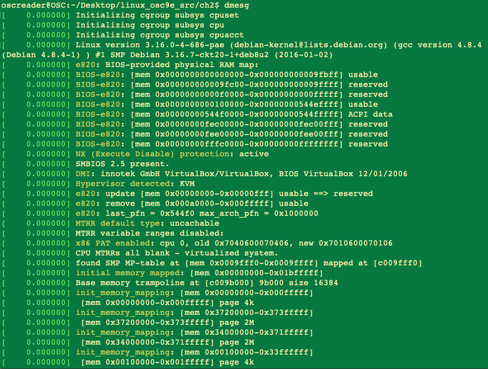

```
  /\/\
 /- - \
 \ i  /
 /    \
/||  ||\_
\\\  ///))
 \\\/////
  UOOU//
      V
```


(PERSONAL FYI: Detailed notes are in my Evernotes.)


This directory contains code I wrote as part of completing chapter 2’s Programming Project - Linux Kernel Modules.


Project Description - Linux Kernel Modules
===


Part I - Creating Kernel Modules
===


Steps to create and insert a module in the the Linux kernel.


command: `lsmod`


Lists all kernel modules, currently loaded.


Output: Name, size, where used.


Output from my Linux VM:


Given source code: `simple.c`.


module entry point = function called when the module is loaded into the kernel.
Must return 0 if init. is successful.


module exit point = function called when module is removed from the kernel.


command: `dmesg`


Prints out the **kernel log buffer**.


Here is the `dmesg` output:





To compile `simple.c` use given **makefile**.


Here is the **make** output:


The result of compilation is a file called `simple.ko`, this is the **compiled
kernel module**.


**Loading and removing kernel modules.**


* command: `sudo insmod simple.ko`
  * Loads a kernel module.


Here is the output:


* command: `lsmod` (See output above, img1.png).
  * List all kernel modules, check that your module appears in the list to verify that it was loaded successfully.


Here is the output:


* command: `dmesg`
  * Inspect the kernel log buffer to view prints from your module.


Here is the output:


* command: `sudo rmmod simple`
  * Removes the named module from the kernel.
  * Note there is no need for the `.ko` file extension here.


Here is the output:


* Use `dmesg` to verify that the module was unloaded.
  * command: `sudo dmesg -c`
    * clears the kernel log buffer.


Here is the output:


Part II - Kernel Data Structures
===


Part II Description:


Part II Assignment:


Given:


Givens:


* <linux/list.h>
* struct list_head
* <linux/types.h>
* static LIST_HEAD(birthday_list);
* kmalloc()
* kfree()
* INIT_LIST_HEAD(&person->list)
* list_add_tail(&person->list, &birthday_list);
* list_for_each_entry(ptr, &birthday_list, list) {}
* list_del(&person->list);
* struct birthday *ptr, *next;
  * list_for_each_entry_save(ptr, next, &birthday_list, list) {}


* FYI: Most of the linux header files can be viewed in:
  * `/usr/src/linux-headers-3.16.0-4-common/include/linux/`


I implemented this project in `simple.c`.


Here is the `make` output:


Output of `dmesg` after module insert:


Output of `dmesg` after module removal:


What’s up with the “license MIT taints kernel” message? Does it go away if I set it back to GPL?


ANS: Yes.


Here is the dmesg output after module insertion and removal:


FYI: Frequently used commands:


sftp -P 2222 oscreader@127.0.0.1


scp -P 2222 -r * oscreader@127.0.0.1:/home/oscreader/Desktop/linux_osc9e_src


ssh -p 2222 oscreader@127.0.0.1


