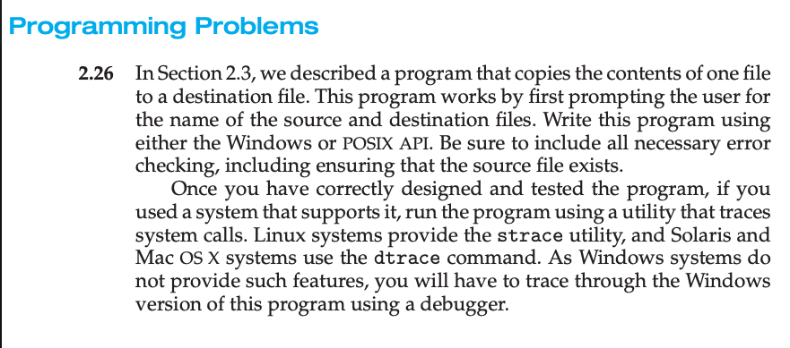
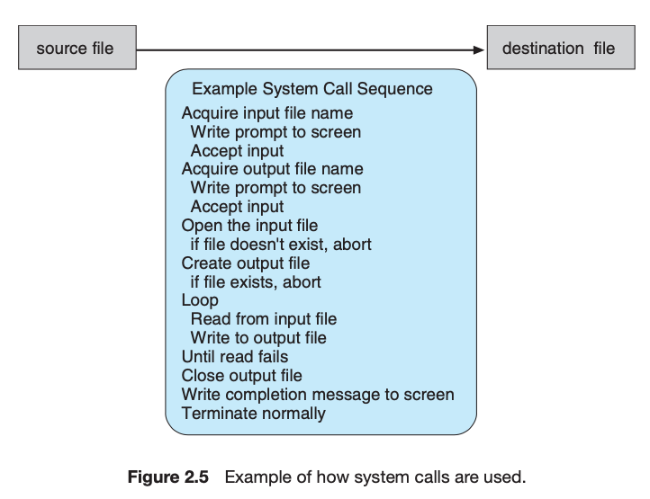
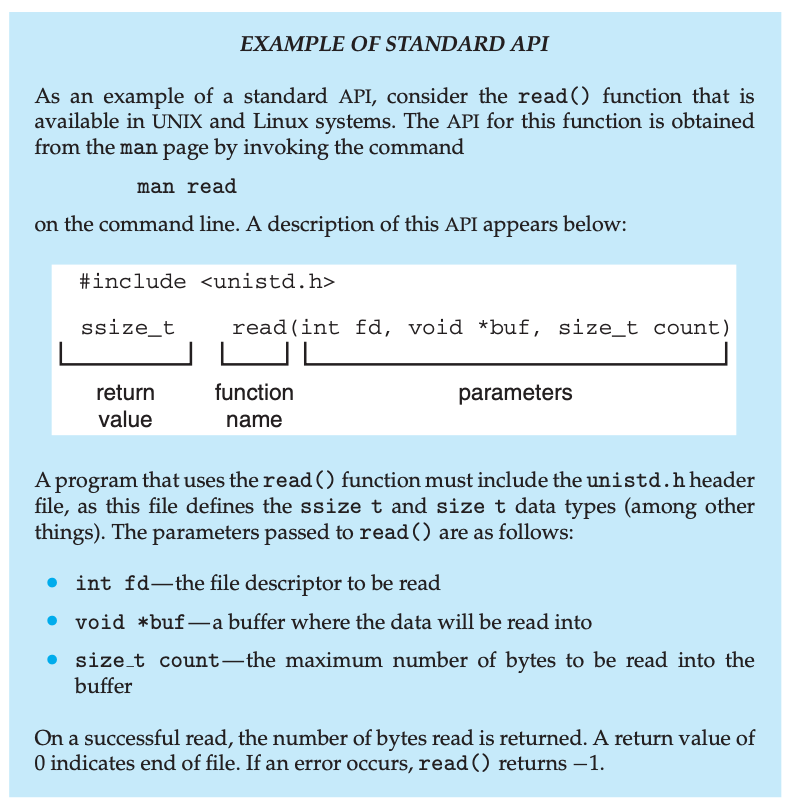
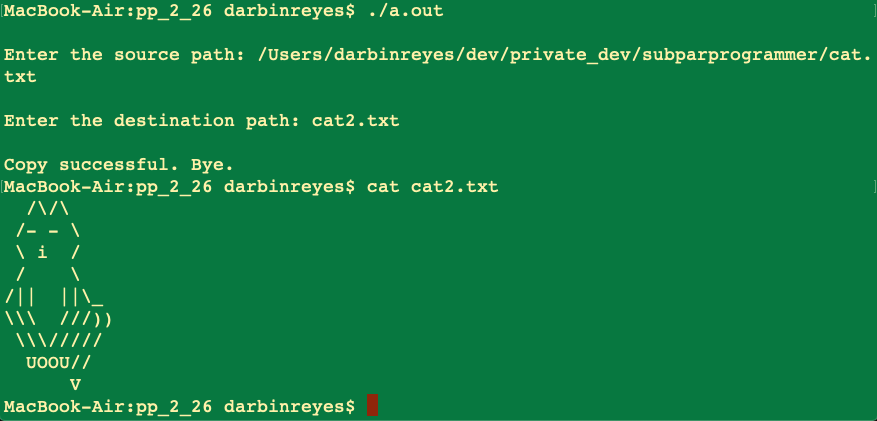
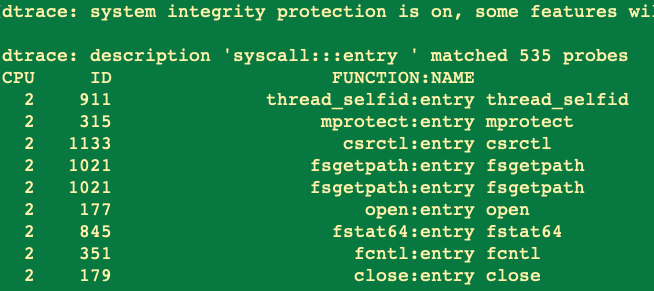
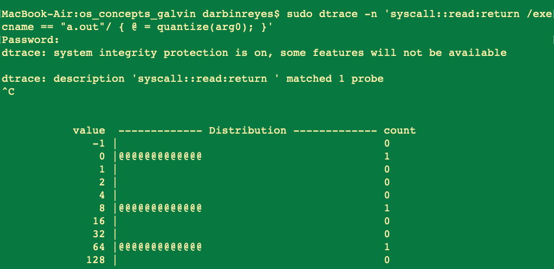

```
  /\/\
 /- - \
 \ i  /
 /    \
/||  ||\_
\\\  ///))
 \\\/////
  UOOU//
      V
```


(PERSONAL FYI: Detailed notes are in my Evernotes.)


This directory contains code I wrote as part of completing Programming Problem
2.26.


Problem Description
===





Given Pseudo-code for the program to be implemented:





Given. How to access system call man pages
On Mac OS X, the man page is “man 2 read”.





The problem asks you to use dtrace.


Section 2.8.3 discusses dtrace.


dtrace is the primary tool for kernel debugging. It is the most powerful debugging tool for OS debugging.


I used [this tutorial](https://wiki.freebsd.org/DTrace/Tutorial) to figure out how to use dtrace as requested by the problem.


Problem solution - .c code.
===


My solution is in the file `prog_prob_2_26.c`.


To compile on Mac OS X: `cc prog_prob_2_26.c`


To run: `./a.out`


Example use and output:





Problem solution - dtrace command
===


On Mac OS X, dtrace is available.


The problem says nothing about how to use dtrace, you must RTFM. Since the problem is vague about specifics I had to decide how to interpret what was being asked with respect to dtrace. I settled on the two commands below.


Use dtrace to print the name of the system call that is called, “live”, i.e. during my program’s execution.


Command 1:


`sudo dtrace -n 'syscall::read:return /execname == “a.out"/ { @ = quantize(arg0); }'`


Here is a clip of the dtrace output:





Notice the system calls are listed in the leftmost column of the output.


Command 2:


Use dtrace to print a histogram, upon termination of my program, of the number
of bytes read by read() system calls.


Here is the output:





Notice in the above output that 1 call to read() returned between 64 and 128
bytes. The file copied by my program was 79 bytes, which is consistent with the
dtrace output.

End.