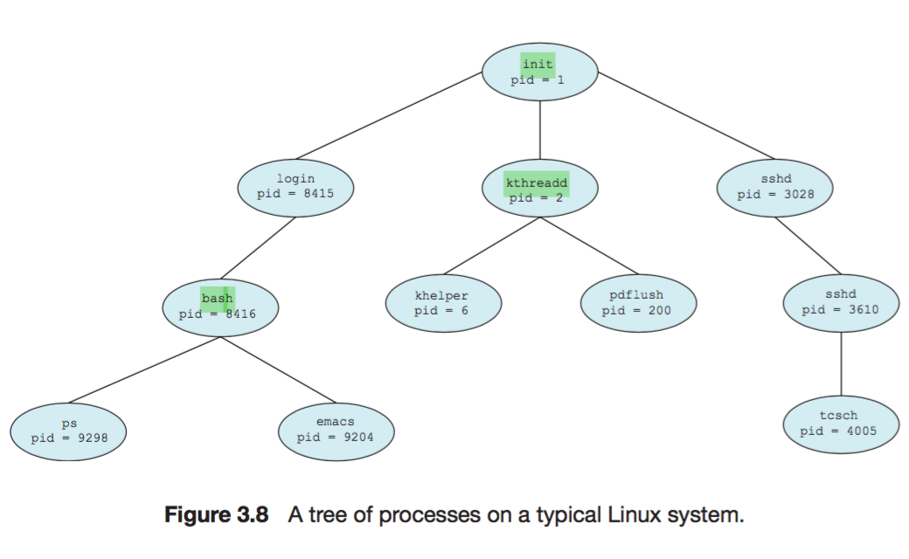
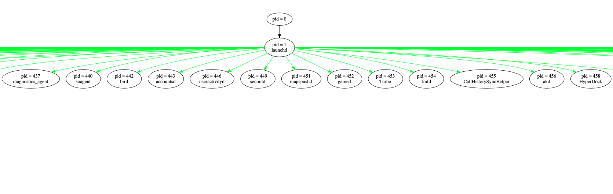
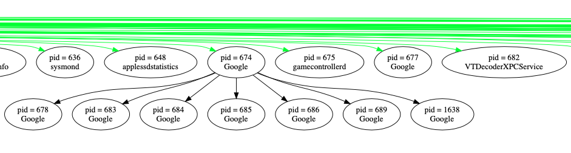
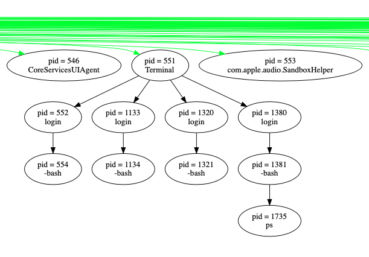

My solution to Exercise 3.10 from Operating System Concepts, Galvin.

Problem Statement.

Construct a process tree similar to **Figure 3.8**. To obtain process information for the UNIX or Linux system, use the command `ps -ael`. Use the command `man ps` to get more information about the `ps` command.

Here is **Figure 3.8**:

* process tree def.:
    * Processes are related to each other in the same way as humans are related to each other - this means we can draw a family tree for the processes running on a given machine. We call this tree a process tree.
* Solution plan:
    * We must create a process tree from the ps command output.
    * I will use [graphviz](https://graphviz.org/) to render an image of the tree.
    * **Using Grapviz:**
        * Installing graphviz: `sudo port install graphviz graphviz-gui`
        * The above installs `/Applications/Graphviz.app`.
        * Command to open graphviz app: ` /Applications/Graphviz.app/Contents/MacOS/Graphviz`
        * [graphviz documentation](https://graphviz.org/documentation/)
        * To get started, download `demo.c` and `Makefile`. Compile using `make demo` and run using `./demo -K dot -Tpng > out.png && open out.png` (per comments in .c file).
        * Also installed:
            * All commands listed under "Layout manual pages”. e.g. `man dot`.
                * dot can output .png files.
            * All commands listed under "Tool manual pages”. e.g. `man acyclic`.
        * To see the docs for a given graphviz C header file see "C libraries”. e.g. in `demo.c` occurs `#include <gvc.h>`, the docs are [here](https://graphviz.org/pdf/gvc.3.pdf).
            * Man pages:
            * `man gvc`
            * `man cgraph`
            * `man cdt`
        * Many “.dot” graph attribute examples are shown [here](https://graphviz.org/doc/info/shapes.html#html).
            * e.g.

* Plan:
* for each line in ps_out.txt
    * create a node with label = process name and pid.
        * Use e.g.  `n = agnode(g, "n", 1);`
* for each line in ps_out.txt
   * Add an edge connecting PID to PPID.
   * Use e.g `e = agedge(g, n, m, 0, 1);`
    * The output of the `ps -ael` command on Mac OS X, was piped to the file `ps_out.txt`.
    * Notes:
        * PID = 1 = launchd
        * There is a man page for most system P executable: e.g. “man launchd"

My solution is implemented in demo.c.

On Mac OS X:

To compile: `make demo`

To run: `./demo -K dot  > out.dot && open out.dot`

The resulting out.dot file can be opened using `/Applications/Graphviz.app`.

or alternatively, for .png output: `./demo -K dot -Tpng > out.png && open out.png`

The resulting graph is huge, Graphviz.app makes it much easier to view.

Here are a few clips from the resulting graph/process-tree. It is too large to view in a single image, (for that, see out.png). Using Graphviz.app to open out.dot looks much nicer.

* [ ] TODO: Consider implementing in python. To install the python wrappers to graphviz use `port install py28-graphviz`.

