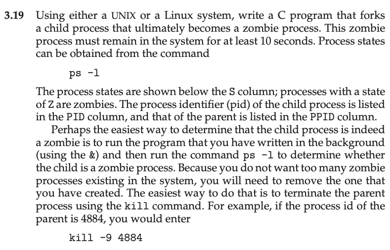

This is my solution to programming problem 3.19 from Operating System Concepts, Galvin.

Problem Statement.
===

Problem Notes.
===

Use Unix.

Use C.

Use fork().

Zombie should exist for >= 10 seconds.

Use `ps -l`

Look under S/PID/PPID column. State = Z.

Run program using `& ps -l`.

To remove zombies kill the **parent** process e.g. `kill -9 4884`.

Solution Plan
===

A zombie process is one which has terminated and whose parent process never called wait().

We can write a C program that calls fork() and in the parent process does something for 10 seconds and in the child process terminates immediately.

Solution Description and Results
===

The solution is in prog_prob_3_19.c.

On Mac OS X,

To compile: `cc prog_prob_3_19.c`

To run: `./a.out`

The below is the output of `ps -l` with the zombie process highlighted.

