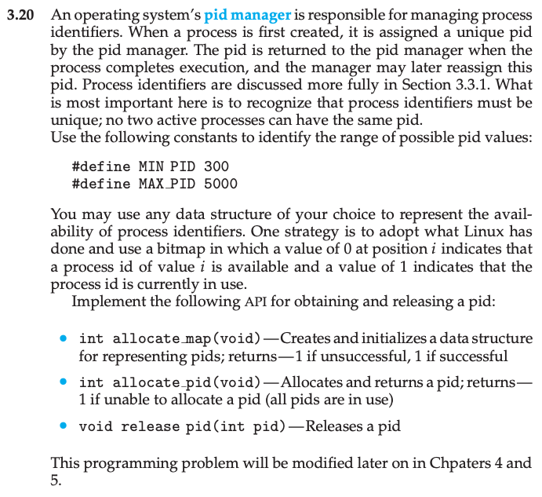
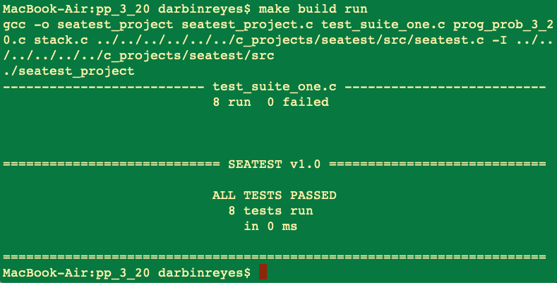

This is my solution to programming problem 3.20 from Operating System Concepts, Galvin.

Problem Statement.
===

Problem Notes.
===

Storing the state of a PID in bits is a trivial improvement so I ignore it for now. The return values are not clear. I specify that: allocate_map() returns 0 if successful, -1 on failure; allocate_pid() returns a value between MIN_PID and MAX_PID if successful, -1 otherwise, meaning it failed.

The easiest solution is to store the state of each PID, (0 = free vs. 1 = in use) in a char array. allocate_map() simply initializes this array to all 0’s (at compile time). When allocate_pid() is called, we can search the state array for a free PID and return it if a free PID is found, or return -1 indicating no free PIDs are available. When release_pid() is called we can use the PID as an index into the state array and mark that PID as free again. With this implementation, allocate_map() and release_pid() have O(1) time complexity, allocate_pid() will search the entire PID state array in the worst case, O(size of PID state array). Since the size of the PID state array is constant, this solution is acceptable.

Can we make allocate_pid() have a time complexity of O(1) without slowing down the other two functions? In general this can be achieved with an appropriate choice of data structures (a.k.a. abstract data types (ADT)). The ADT options are:

* Bag
* Stack
* Queue/Double-ended Queue/Priority Queue
* Lists
* Dictionaries/Hash-table
* Trees
* Heap
* Graph

We should/could maintain a count of the number of allocated PID’s so that we never search the state array when all PID’s are currently in use.

We could maintain a list of available PIDs in a linked list. But allocate_map() might have to do extra work in this case. Overall this seems like a bad idea.

We could maintain the available PIDs in a **stack**. When we allocate a PID, we pop a PID from this stack, when we release a PID we push to this stack. All three functions should be O(1) with this implementation. I will use this approach.

Solution Plan.
===

allocate_map(). Initializes a char array of size (MAX_PID-MIN_PID+1) to all 0’s. 0 indicates that PID = index + MIN_PID is free for use. 1 indicates that the PID is in use. Also initialize a stack of the same size, filled with all PIDs from MIN_PID to MAX_PID.

allocate_pid(). If the stack is empty, no PID is available. If the stack is not empty, pop a value off the stack, assert that the value is free, mark the value as in use in the state array. Assert that the value is in range [MIN_PID-MAX_PID], return the value.

release_pid(). If the call is invalid, e.g. it is invalid to release a PID that is not marked as in use, does nothing, returns. Assert that the value is in range [MIN_PID-MAX_PID], assert that the value is currently marked as in use, mark the value as free, assert that the stack is not full, push the value on to the stack.

Optionally, store the PID state in a bit packed array. I will skip this. Depending on the HW, this is a space/time tradeoff. Bit packing will save space, but slow down access. 1 bit per PID vs. 1 byte per PID.

Solution Test Cases.
===

On a per function basis.

* allocate_map().
  * Verify that the state array is all 0’s and that the stack is full of valid PIDs.

* allocate_pid().
  * Allocate 1 PID. Check that PID range is valid. Check that the number of free PIDs has decreased by 1.
  * Allocate 2 PIDs. Check that PID range is valid. Check that the number of free PIDs has decreased by 2.
  * Allocate NUM_PIDS PIDs. Check that each PID is in valid range. Check that the number of free PIDs is 0.
  * Allocate NUM_PIDS+1 PIDs. Check that -1 is returned since there are no free PIDs. Check that the number of free PIDs is 0.

* release_pid().
  * Release PID = 299. Check that the number of free PIDs is unchanged.
  * Release PID = 5001.  Check that the number of free PIDs is unchanged.
  * Allocate 1 PID. Release PID.  Check that the number of free PIDs is unchanged.
  * Allocate 1 PID. Release PID.  Check that the number of free PIDs is unchanged. Release the same PID. Check that the number of free PIDs is unchanged.
  * Allocate all PIDs. Release all PIDs. Check that the number of free PIDs is unchanged.

Solution Description and Results.
===

My solution consists of the following files:

prog_prob_3_20.c
prog_prob_3_20.h
stack.c
stack.h

The test code files are:

seatest_project.c
test_suite_one.c
makefile

On Mac OS X:

To compile: `make build` or `make build_dbg`
To run: `make run`

Test results:

