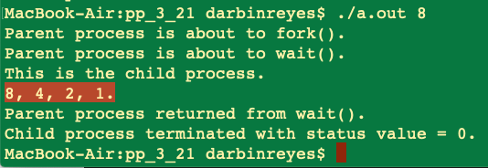
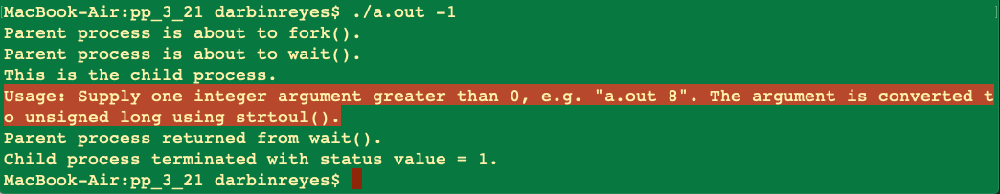

This is my solution to programming problem 3.21 from Operating System Concepts, Galvin.


Problem Statement.
===


Problem Notes.
===


Use fork().


Child process generates sequence.


Get starting number from command line parameter.


Child process should output the sequence.


In the parent, use wait() so that it waits for the child to compute the sequence.


Validate command line parameter. If none is provided, inform the user. If it is not a positive integer >= 1, inform the user. Otherwise compute the sequence.


Test cases:


n = 35.


Sequence = 35, 106, 53, 160, 80, 40, 20, 10, 5, 16, 8, 4, 2, 1


n = 8.


Sequence = 8, 4, 2, 1.


Solution Plan.
===


The command line parameter should be: argc = 2, argv[1] == positive integer >= 1.


Use atoi() or similar to convert arg to unsigned integer.


To compute the sequence:


```C
// Since the point of this is to learn about OS concepts and not C programming:
// FYI: I will not check for overflow.
// FYI: The command line parameter validation will be very basic.
// FYI: I will assume the Collatz conjecture is in fact true. If it is false, then there will exist values of n for which this program will never terminate.

void print_collatz(unsigned int n) {
  assert(n > 0);

  if (n == 1) {
    // Done.
    printf(“1.\n“);
    return;
  } else {
    printf(“%u, “, n);
  }

  if (n & 0x01 == 0) {
    // n is even
    n >>= 1; // n = n/2
  } else {
    // n is od
    n = 3*n + 1;
  }

  print_collatz(n);

}

```


The output will be to stdout, comma separated, and on the same line. e.g. for n = 8, the output will be “8, 4, 2, 1.”


Solution Test Cases.
===


Test cases:


n = 35.


Sequence = 35, 106, 53, 160, 80, 40, 20, 10, 5, 16, 8, 4, 2, 1


n = 8.


Sequence = 8, 4, 2, 1.


n = 3.


Sequence = 3, 3*3+1=9+1=10, 10/2=5, 3*5+1=15+1=16, 16/2=8, 8/2=4, 4/2=2, 2/2 = 1. i.e. 3, 10, 5, 16, 8, 4, 2, 1.


n = 0.


No sequence. Report error.


n = 1.


Sequence = 1.


n = -1.


No sequence. Report error.


n = abc.


No sequence. Report error.


n = command line argument not provided.


No sequence. Report error.


Solution Description and Results.
===

My solution is in `prog_prob_3_21.c`.

On Mac OS X,


To compile: `cc prog_prob_3_21.c`.


To run: `./a.out n’ where n is a positive integer >= 1.


The images below show the output for various values of n. The highlighted line is the important part of the output, everything else is informational.


n = 35.


n = 8.



n = 3.


n = 0.


n = 1.


n = -1.



n = abc.


n = command line argument not provided.


End.
===
