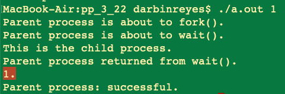

This is my solution to programming problem 3.22 from Operating System Concepts, Galvin.

Problem Statement.
===

Problem Notes.
===

Remark: March 12, 2021. I reviewed this code as part of completing programming problem 9.40 and discovered many problems. The following notes may no longer be entirely correct.

This is a modified version of the program for programming problem 3.21. I used that program as a starting point.

Changes: The child process will write the computed sequence to a shared memory region, when the child terminates, the parent outputs the sequence.

Refer to section 3.5.1. The following is example code from this section.

Using wait() serves to synchronize the two processes.

Solution Plan.
===

The child process is the producer of the sequence. Refer to producer code example.

The parent process is the consumer of the sequence. Refer to consumer code example.

Modify child process code to:

1. Get the command line argument (no code changes here).

2. Setup shared memory for READ/WRITE.

3. Write the sequence to shared memory. Add code to stop writing to shared memory if we run out of space, inform the user that the sequence was truncated.

4. return.

Modify parent process to:

1. After the call to wait() returns, open the shared memory region.

2. Output the contents of the shared memory region.

3. Close the shared memory region.

Solution Test Cases.
===

n = 35.

Sequence = 35, 106, 53, 160, 80, 40, 20, 10, 5, 16, 8, 4, 2, 1.

n = 8.

Sequence = 8, 4, 2, 1.

n = 3.

Sequence = 3, 10, 5, 16, 8, 4, 2, 1.

n = 0. n = 1. n = -1. n = abc. n =[no input].

No sequence. Report error.

n = 35 with Shared memory size set to 25 bytes to test buffer size check is working.

Truncated Sequence = "35, 106, 53, 160, 80, "

Solution Description and Results.
===

On Mac OS X,

To compile: `cc prog_prob_3_22.c`

To run: `./a.out n` where n is >= 1.

To check the return status: `echo $?`.

The command line output of the test cases follow.

n = 35.

n = 8.

n = 3.

n = 0.

n = 1.

n = -1.

n = abc.

n =[no input].

**n = 35** with Shared memory size set to **25 bytes** to test buffer size check is working.

End.
===
