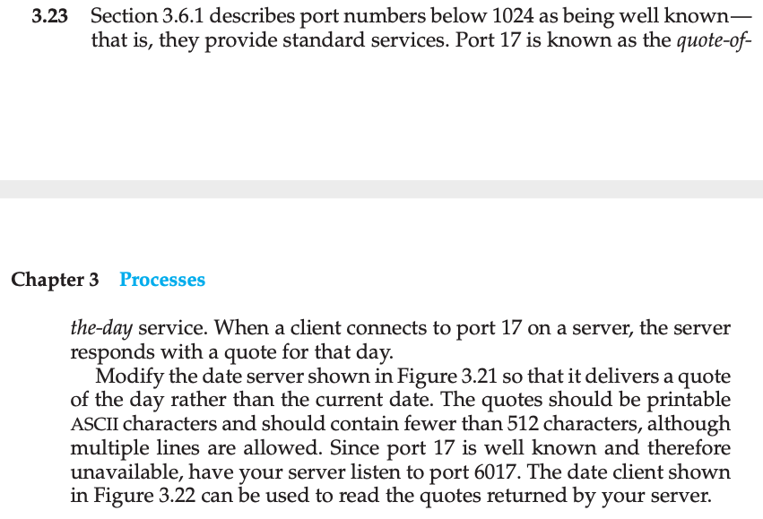
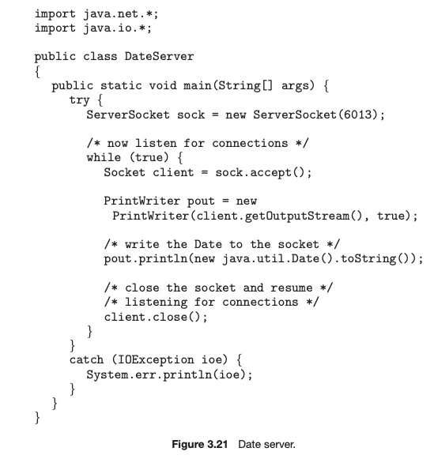
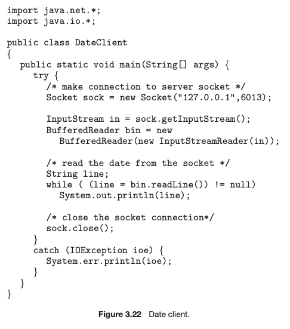
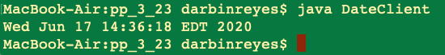
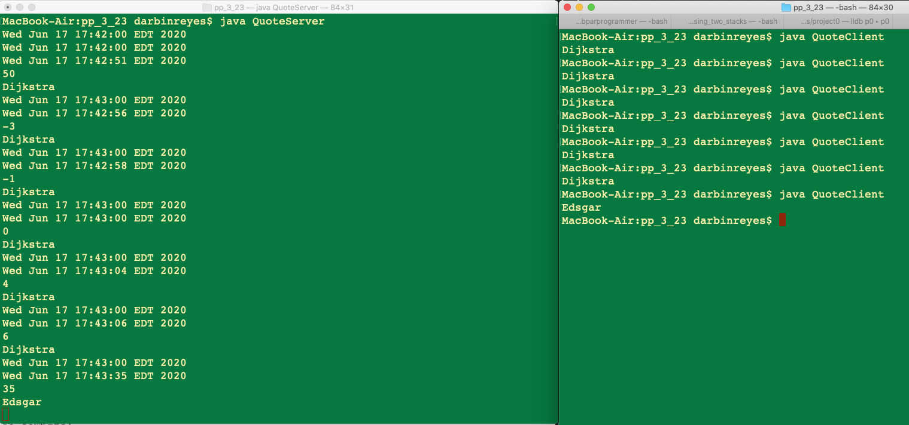

This is my solution to programming problem 3.23 from Operating System Concepts, Galvin.

Problem Statement.
===

Problem Notes.
===

Figure 3.21:

Figure 3.22:

Solution Plan.
===

Starting with given server and client code above.

On Mac OS X,

To compile: `javac DateServer.java`, `javac DateClient.java`.

The result of compilation are the files: `DateServer.class`, `DateClient.class`.

To run: `java DateServer`, `java DateClient`.

The DateServer continues running silently until terminated:

The DateClient prints the date and terminates:

Changes.

In both server and client, modify port number from 6013 to 6017.

Rename DateServer.java to QuoteServer.java, DateClient.java to QuoteClient.java.

Add an array of strings to QuoteServer.java. This will be the source of quotes. An index into this array will point to today’s quote. Each time the server accepts a connection, it returns today’s quote to the client and then increments the quote index modulo the size of the array so that the index wraps. The result is a server that returns a different quote each time a client connects.

In QuoteServer.java, replace `pout.println(new java.util.Date().toString());` with `pout.println(quotes[index]);`.

To return a different quote on a per day basis, upon starting the server, save a timestamp set to the current day at midnight. Each time a client connects to the server, we compute the difference between the timestamp and the current time, if the difference is greater than 1 day, increment the quote index and return the corresponding quote, finally, set the timestamp to today at midnight. Otherwise, if the time difference is less than 1 day, return the quote corresponding to the current index.

For testing purposes, I have implemented the program so that a new quote is returned on the 30th second of every minute.

Solution Test Cases.
===

Verified that every quote is returned after the appropriate amount of time has elapsed and that the quote index wraps when expected.

Solution Description and Results.
===

On Mac OS X,

To compile: `javac QuoteServer.java`, `javac QuoteClient.java`.

To run: `java QuoteServer`, `java QuoteClient`.

The command line output below shows the server’s output after several client connections. The server’s output is on the left, the client’s output is on the right. For each client connection, the server prints its last saved time stamp, the current time, the number of seconds that have elapsed, and finally the current quote. The client prints only the quote received from the server.

End.
===
