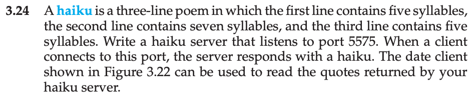
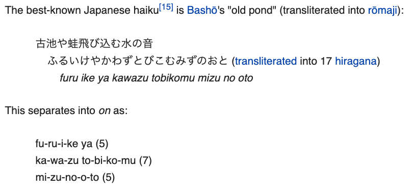
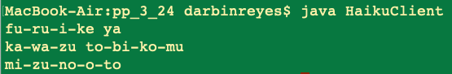

This is my solution to programming problem 3.24 from Operating System Concepts, Galvin.

Problem Statement.
===

Problem Notes.
===

Find a haiku online:

Here is the text from the above:

fu-ru-i-ke ya (5)
ka-wa-zu to-bi-ko-mu (7)
mi-zu-no-o-to (5)

old pond
frog leaps in
water's sound

Server listens on port 5575. Server Responds with the haiku.

Solution Plan.
===

Start with DateServer/Client code given for problem 3.23.

Update the server and client port to 5575.

Modify server to respond with haiku instead of date.

Solution Test Cases.
===

Test that the haiku is returned when the client execute.

Solution Description and Results.
===

On Mac OS X,

To compile: `javac HaikuServer.java`, `javac HaikuClient.java`.

To run: `java HaikuServer`, `java HaikuClient`.

Here is the server executed on the command line (it is silent):

Here the client executed on the command line:

End.
===