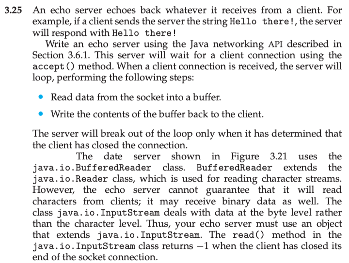

This is my solution to programming problem 3.25 from Operating System Concepts, Galvin.

Problem Statement.
===

Problem Notes.
===

We will have to modify the client to send data, not just connect and wait for a response.

Server will use accept() method.

Upon receiving a connection, server enters a loop and:

1. Read data from the socket, into a buffer.

2. Write contents of buffer from step 1 back to the client.

3. The server exits the loop when the **client** closes the connection.

The problem statement appears to have a typo. There is no occurrence of `java.io.BufferedReader` in figure 3.21, however client does use `java.io.BufferedReader` as shown below.

In any case, it seems clear that will have to add something similar to `BufferedReader` to the server, in a manner similar the client, because the server is now reading data, not just writing data.

It is given that there is a class similar to `java.io.BufferedReader`, but with support for non-character data, this class is `java.io.InputStream`. FYI `BufferedReader` extends `java.io.Reader`. `java.io.BufferedReader` is intended only for use with character data. Since the server is now sending data to the client which originated from the client, the server must account for having to send non-character data.

It is given that the server “will use an object that extends” `java.io.InputStream`. Q: Why not use `java.io.InputStream` directly?

It is given that `java.io.InputStream.read()` returns -1 when the client has closed the connection. This gives us the guard of the loop viz. `while (InputStream.read() != -1)`.

Solution Plan.
===

1. I will implement a version of the program that deals only with character data. 2. I will test what happens if the client writes non-character data.
3. I will modify the program to deal with non-character data.
4. Modify the client to use command line arguments as the string to send to the server.

FYI: Java docs for `InputStream` etc. are [here](https://docs.oracle.com/javase/8/docs/api/java/io/InputStream.html).

Solution Test Cases.
===

Test sending the string "Hello Dijkstra.”.

Test sending the array {2, 3, 5, 7, 11, 13}.

Solution Description and Results.
===

On Mac OS X,

To compile: `javac EchoClient.java`, `javac EchoServer.java`

To run: `java EchoClient`, `javac EchoServer`.

Command line output for client sending the string "Hello Dijkstra.”:

Command line output for the server:

Command line output for client sending the array {2, 3, 5, 7, 11, 13}:

Command line output for the server:

End.
===
