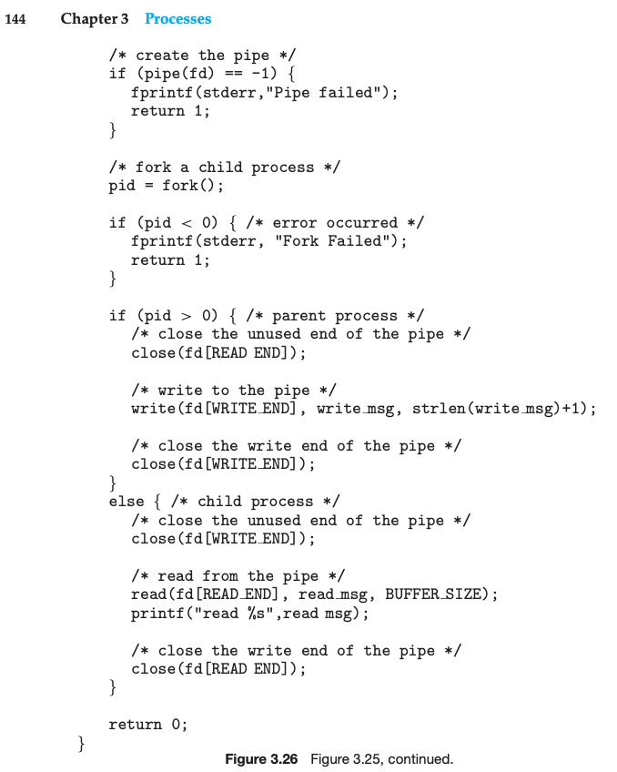

This is my solution to programming problem 3.26 from Operating System Concepts, Galvin.

Problem Statement.
===

Problem Notes.
===

Interprocess communication. Use ordinary pipes.

Two processes involved.

Process 1. Send string “Hello Dijkstra”.

Process 2. Returns string case reversed.

Two pipes. P1->P2. P1<-P2.

Use Unix.

Relevant notes from the textbook.

See `man 2 pipe`.

Solution Plan.
===

Start with the given code.

Add an additional pipe for data transfer from child to parent. Send the string “Hello Dijkstra.”

Use <ctype.h> to perform the letter case transformation. isupper() islower() toupper() tolower().

Have each process print the string read from the pipe.

Solution Test Cases.
===

Just one:

Solution Description and Results.
===

On Mac OS X,

To compile: `cc prog_prob_3_26.c`

To run: `./a.out`

End.
===
