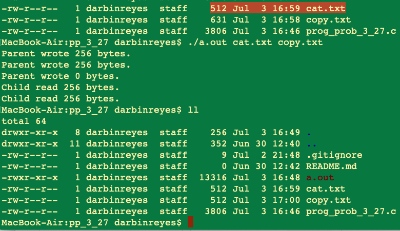

This is my solution to programming problem 3.27 from Operating System Concepts, Galvin.

Problem Statement.
===

Problem Notes.
===

This problem is very similar to the previous one: 3.26.

Solution Plan.
===

Start with the code for the previous problem and modify it.

Remove the pipe from child to parent process.

Get file names from 1st and 2nd program arguments.

Open the first file for reading.

Open the second file for writing.

Have the parent process read from the file and write to the pipe.

Have the child process read from the pipe and write to the file.

Add full error checking for file operations.

Add a repetition to support arbitrary file sizes.

Solution Test Cases.
===

* Test that the program behaves correctly with an input file size:
  * Less than the buffer size.
  * Equal to the buffer size.
  * Greater than the buffer size.
  * 0 byte file.
  * A multiple of the buffer size.
  * A multiple of the buffer size + 1.

* Test that the copy is successfully even if the destination file exists AND does not exist.

* The buffer size is 256 bytes to make these tests easy to verify.

Solution Description and Results.
===

On Mac OS X,

To compile: `cc prog_prob_3_27.c -o filecopy`

To run: `filecopy input.txt copy.txt`

Here is the command line output for the test cases:

79 bytes file.

0 bytes file.

256 bytes file.

315 bytes file.

631 bytes file.

512 bytes file.

End.
===
