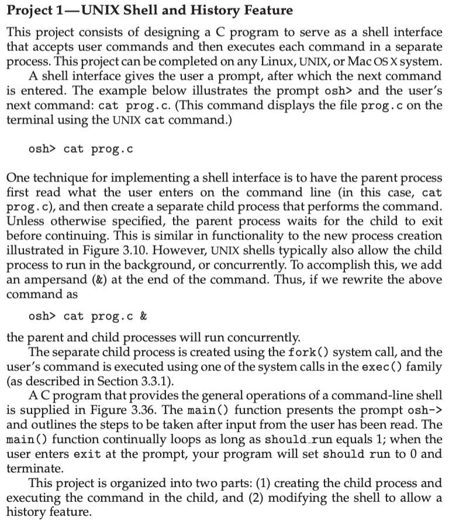
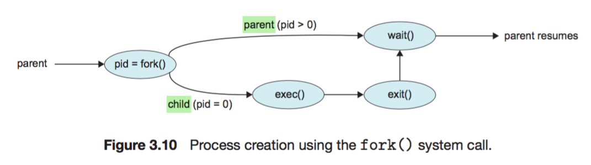
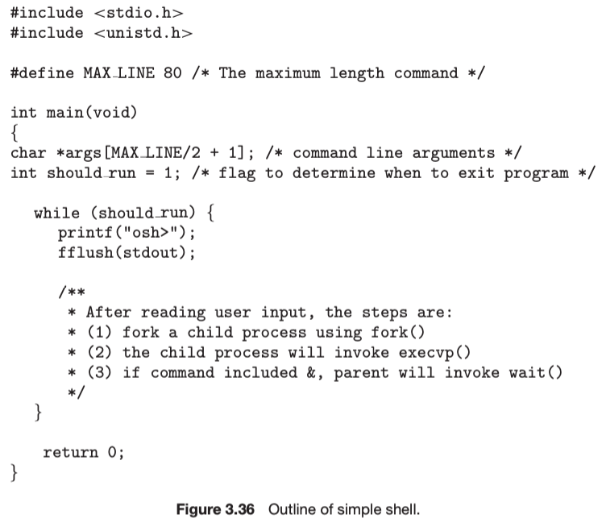
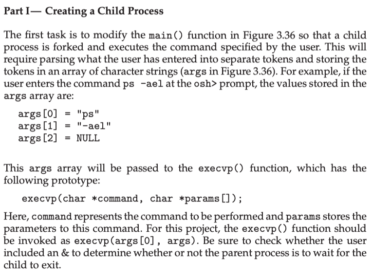
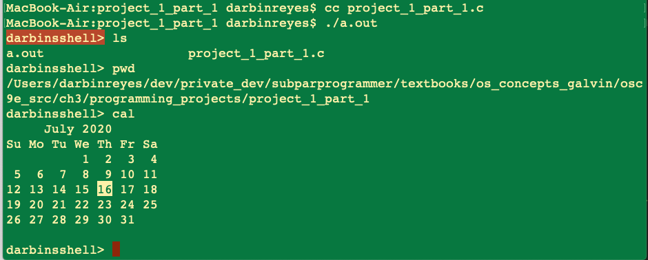
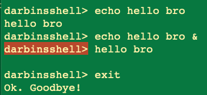

This is my solution to Chapter 3 programming project 1 part 1 from Operating System Concepts, Galvin.

Problem Statement.
===

Problem Notes.
===

C program.

A simple shell interface.

Accept command, run as separate process.

Shell prompt + shell command.

Parent process reads user input. Creates a child process to perform command.

By default, parent process waits for child process to exit.

This is similar to the new process creation pictured figure 3.10:

Most shells allow the child process to execute concurrently with the parent, on macOS this is indicated on the command line with a `&` postfix e.g.
`cat cat.txt &`.

Use fork() to create child process.

Use exec() to execute commands.

Use figure 3.36 as a starting point for the program:

Present prompt in main(), implement given steps.

Loop while should_run = 1.

If user enters “exit”, set above to 0, and terminate.

Parse user input into space separated chunks, NULL terminated, similar to main() args.

Remember to check for “&” in the input, in which case the parent does not wait for the child.

This is unclear: execvp(args[0], args) did he mean args := args[1]? ANS: No. See exec() man page.

Solution Plan.
===

**Step 0**

Start with given code.

Loop while should_run == 1.

Print the prompt.

Read in line.

To start, just echo the input.

If command == “exit”, set should_run = 0, return from main.

**Step 1**

Add argument parsing, like main() args.

Echo parsed args.

**Step 2**

Add call to exec(), echo command and result.

**Step 3**

Add call to fork(), have child process call exec(), parent waits for child to terminate.

**Step 4**

Add test for the “&” character at end of command. If present, parent does not wait for child to terminate.

Handle error cases.

Done.

Solution Test Cases.
===

Run 3 commands. ls, pwd, cal.

Run a command with `&`, `echo hello bro &`, confirm that the parent runs concurrent.

Run `exit`, confirm termination.

Solution Description and Results.
===

On Mac OS X,

To compile: `cc project_1_part_1.c`

To run: `a.out`

Here’s the output for running `ls`, `pwd`, and `cal`.

Here’s the output for running `echo hello bro` and `echo hello bro &`, with `&` present we observe that the shell prompt occurs before the output of the `echo` command, this confirms that the parent process did not wait for its child to terminate, both parent and child executed concurrently. Also note that the final `exit` command works as intended.

End.
===
