This is my solution to Chapter 3 programming project 1 part 2 from Operating System Concepts, Galvin.

Problem Statement.
===

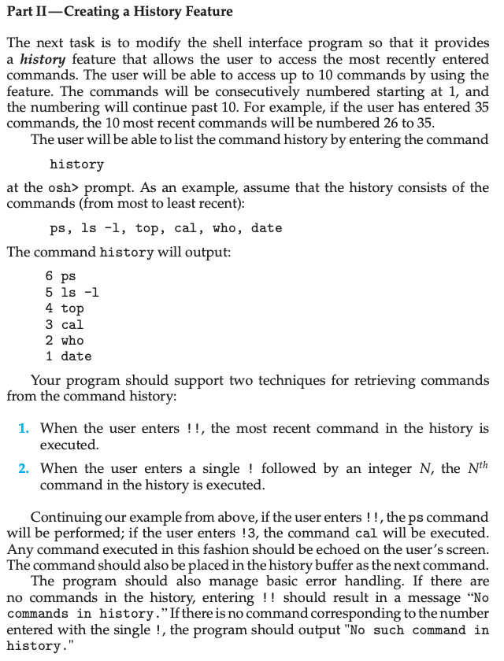

Problem Notes.
===

Building on the program from part 1.

We need to store the 10 most recently executed commands.

If the user enters `history`, the 10 most recent commands are printed. Most recent on the first line, to least recent on the last line.

The output of the `history` command includes a number associated with each command. We must maintain a monotonic count of the total number of commands entered so far. If 100 commands have been entered, then the output would be:

* 100 cmd // Most recently executed command.
* 99 cmd
* 98 cmd
* 97 cmd
* 96 cmd
* 95 cmd
* 94 cmd
* 93 cmd
* 92 cmd
* 91 cmd

* The special command `!!` should:
 1. echo the most recent command.
 2. execute the most recent command.
 3. Update the history to include the command denoted by `!!`.

* The special command `!N` should:
  1. echo the command in history labeled N.
  2. execute the command labelled N.
  3. Update the history to include the command denoted by `!N`.

If `!!` is entered and the history is empty, print “History is empty”.

If `!N` is entered and N is not a valid command label for the current history, print “No such command in history”.

Here’s what bash does for the above error case:

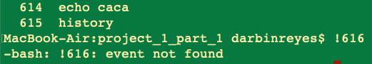

Solution Plan.
===

** Step 0 **

To store a history of 10 commands we can use 10 line buffers.

We can avoid copying entire lines when adding maintaining an array of 10 pointers.

It is easier to work out the implementation assuming a history of 3 commands.

To start, the array of pointers is entirely composed of NULLs.

* 0|->NULL
* 1|->NULL
* 2|->NULL

After entering `cmd_a`:

* 0|->cmd_a
* 1|->NULL
* 2|->NULL

After entering `cmd_b`:

* 0|->cmd_a
* 1|->cmd_b
* 2|->NULL

After entering `cmd_c`:

* 0|->cmd_a
* 1|->cmd_b
* 2|->cmd_c // Most recent command.

After entering `cmd_d`, now our history is full:

One option is to swap the pointers toward lower indexes, in a circular manner, to obtain:

* 0|->cmd_b
* 1|->cmd_c
* 2|->cmd_a // Most recent command.

and then overwrite cmd_a with cmd_d to obtain:

* 0|->cmd_b
* 1|->cmd_c
* 2|->cmd_d // Most recent command.

Solution Test Cases.
===

For simplicity, these tests are done with a history size of 3.

* If history is empty.
* `history`
* `!!`
* `!N`

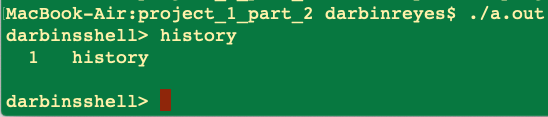

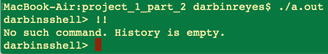

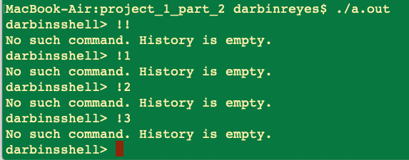

* If history is partially full.
* `history`
* `!!`
* `!N`

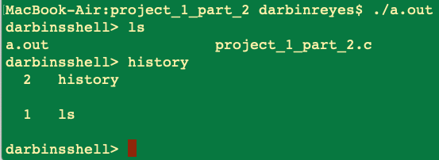

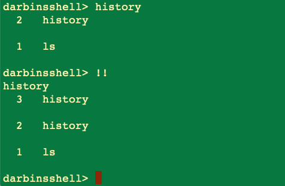

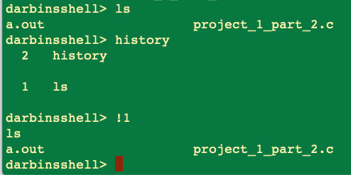

* If history is full.
* `history`
* `!!`
* `!N`

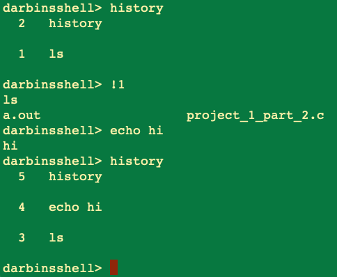

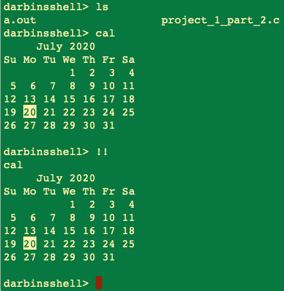

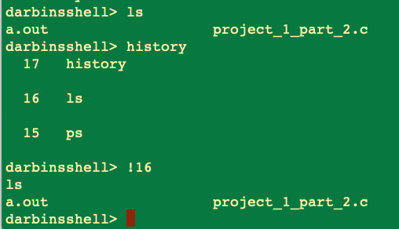

Solution Description and Results.
===

On Mac OS X,

To compile: `cc project_1_part_2.c`

To run: `/a.out`

End.
===

