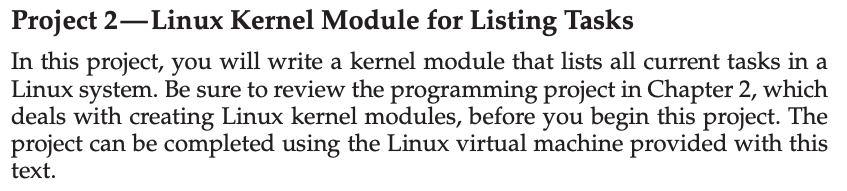
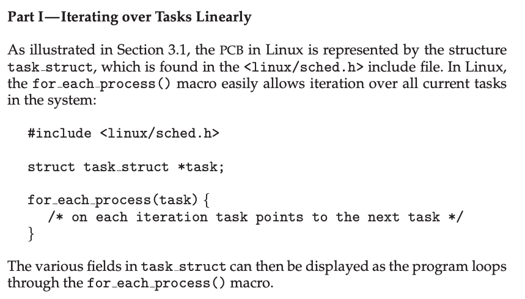
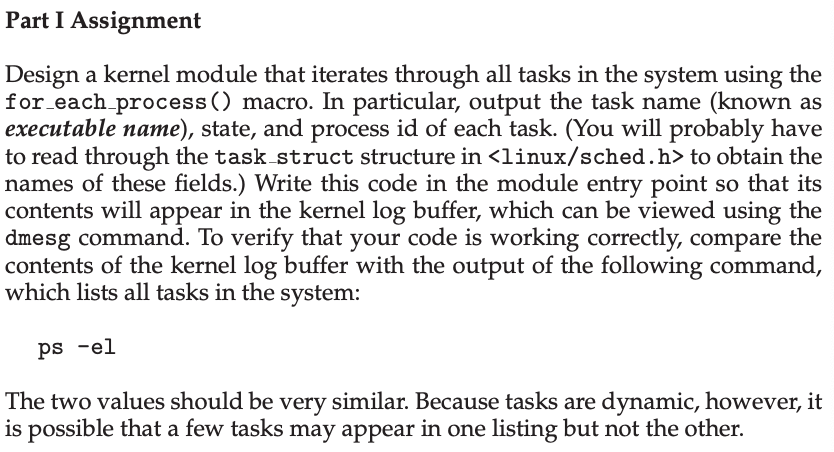
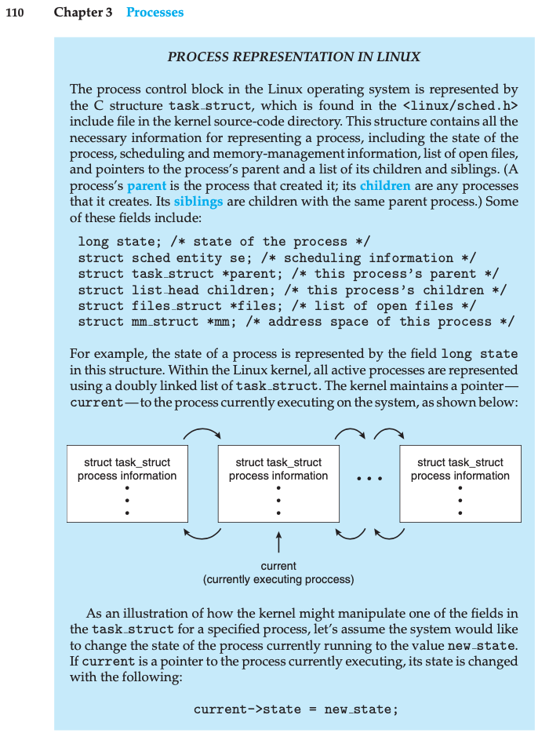
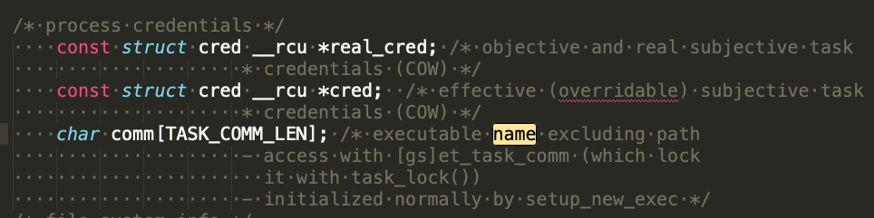
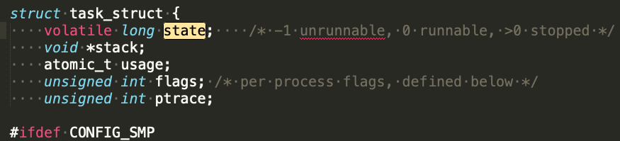
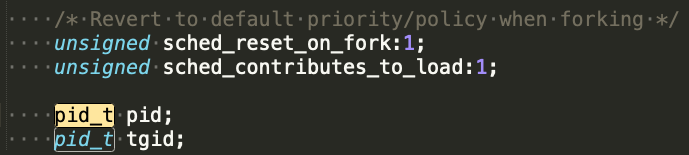
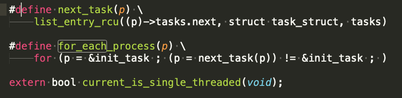
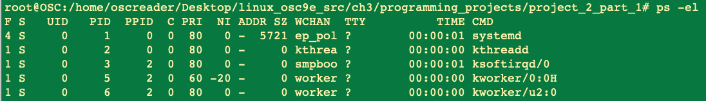
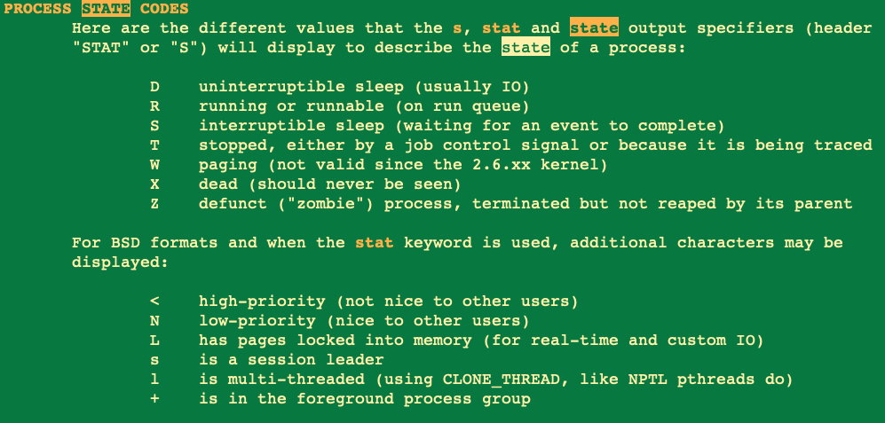

This is my solution to Chapter 3 programming project 2 part 1 from Operating System Concepts, Galvin.

Problem Statement.
===

Problem Notes.
===

Write kernel module, in given Linux VM, like in chapter 2, to list all tasks(= processes) in the system.

From section 3.1:

* What is the full file path of <linux/sched.h> ?

* /usr/src/linux-headers-3.16.0-4-common/include/linux/sched.h

The definition of `struct task_struct` can be found by searching for `struct task_struct {`.

It spans 434 lines! The structure members of interest are: name, state, pid:

Name:

State:

PID:

* Where is for_each_process() defined?

* Same file as `tast_struct` <linux/sched.h>:

Solution Plan.
===

Start with the simple kernel module from chapter 2.

Modify it to iterate over all tasks using for_each_process(). Print: name, state, pid.

Do print inside module entry point, print to kernel log buffer.

Use `dmesg` to view program’s output. Compare to output of `ps -el`. The output will be mostly the same, but not identical since tasks come and go dynamically.

We will need to know how to read the output of the `ps -el` command, here is an example of its output:

The columns of interest are: S, PID, CMD

The S values is defined here:

Solution Test Cases.
===

The output of my program is in `simple.c_output.txt`.

The output of the `ps` command is in `ps_-el_output.txt`.

Solution Description and Results.
===

On a VirtualBox VM running Debian Linux version 3.16.0-4,

To compile: `make`  [See given Makefile.]

To run/insert the kernel module :

`insmod simple.ko` // If you get an error use `su -` first.

To view the output in the kernel log buffer.

`dmesg`

To verify the output:

`ps -el`

To remove the kernel module:

`rmmod simple`

End.
===
