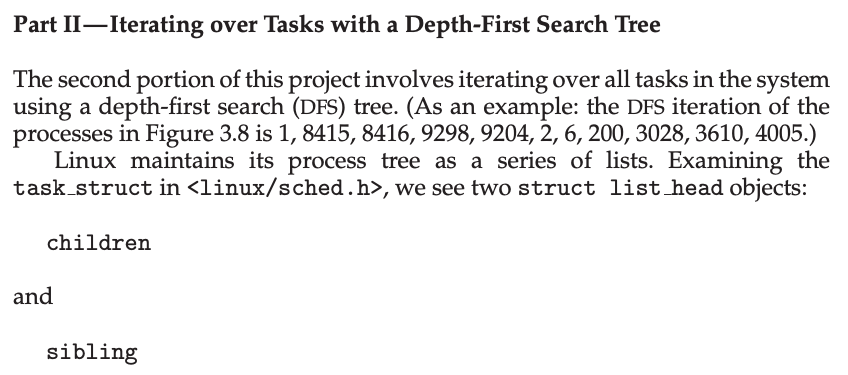
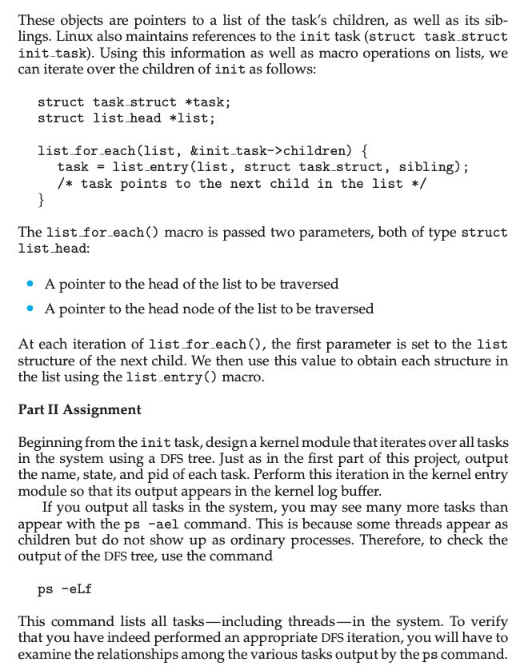
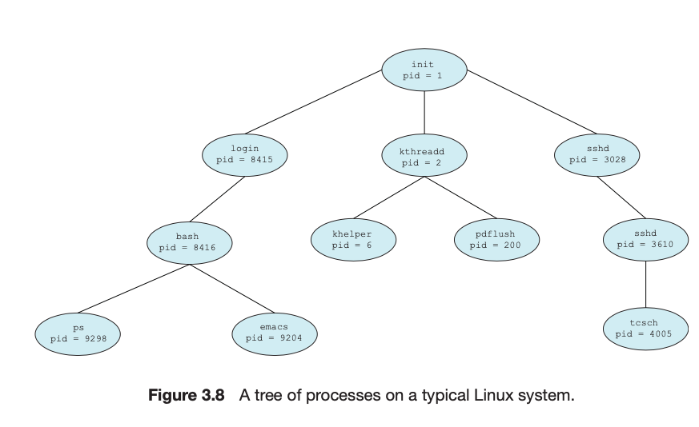
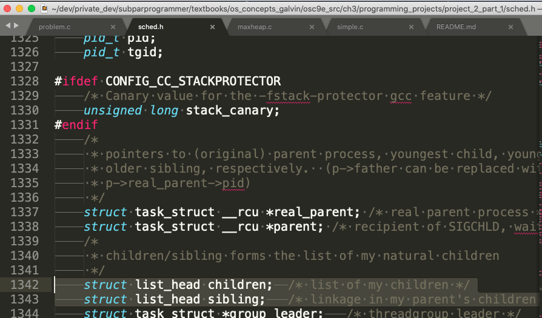
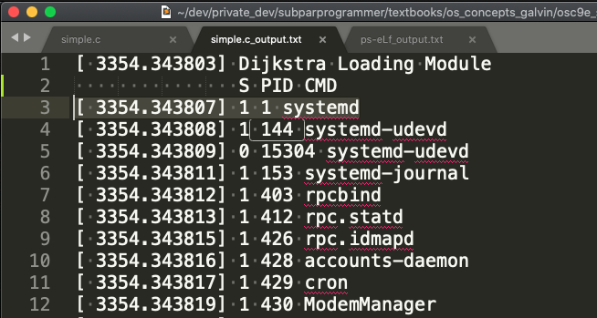
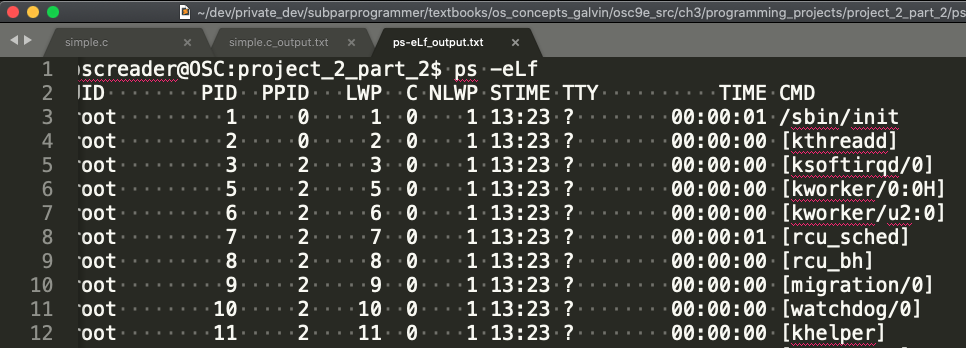

This is my solution to Chapter 3 programming project 2 part 2 from Operating System Concepts, Galvin.

Problem Statement.
===

Problem Notes.
===

It is not clear to me while the last argument of `list_entry()` should be `sibling`, I expected `children`, but the program only works if I use `sibling`.

Figure 3.8 is referenced in the problem statement:

Here are the `children` and `sibling` members of the `task_struct` in `sched.h`:

Use `ps -eLf` to compare against your program’s output.

Solution Plan.
===

Skipped. This is super simple.

Solution Test Cases.
===

Skipped. This is super simple.

Solution Description and Results.
===

The program is implemented in `simple.c`.

I didn’t expect this but its not too surprising, the `init_task` contains garbage in its `pid` and `comm` members, so I don’t print that. I’m pretty sure PPID = 0 in the `ps` command output refers to the `init_task`.

The init process should be first, it is. It has "PID CMD” = "1 systemd”. One of its children should follow, this is indeed the case, "PID CMD” = "144 systemd-udevd”.

The output of my program is in `simple.c_output.txt`. The output shows **144** processes. Here’s a snippet:

The output of the `ps` command is in `ps_-eLf_output.txt`. The output shows **273** processes. “This command lists all **tasks** - including **threads** - in the system.” That explains my program outputs fewer lines than the `ps` command. Here’s a snippet:

A comparison of these two files suggests my output is correct.

On a VirtualBox VM running Debian Linux version 3.16.0-4,

To compile: `make`  [See given Makefile.]

To run/insert the kernel module:

`insmod simple.ko` // If you get an error use `su -` first or use `sudo`.

To view the output in the kernel log buffer:

`dmesg`

To verify the output:

`ps -eLf`

To remove the kernel module:

`rmmod simple`

End.
===
