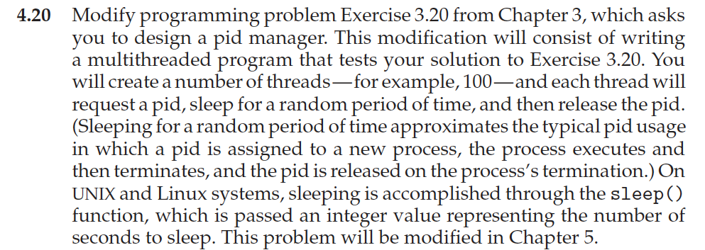
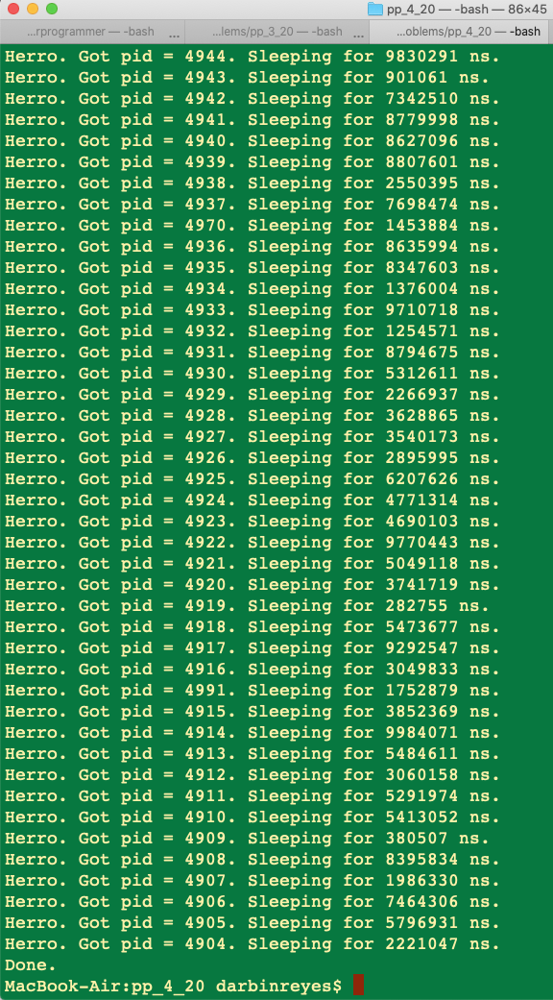

This is my solution to programming problem 4.20 from Operating System Concepts, Galvin.

Problem Statement.
===

Problem Notes.
===

None.

Solution Plan.
===

Create 10 threads.

Get a pid.

sleep for a random amount of time.

Release pid.

Solution Test Cases.
===

None.

Solution Description and Results.
===

On Mac OS X,

To compile: `cc prog_prob_4_20.c stack.c`

To run: `./a.out`

Here’s the terminal output:

End.
===