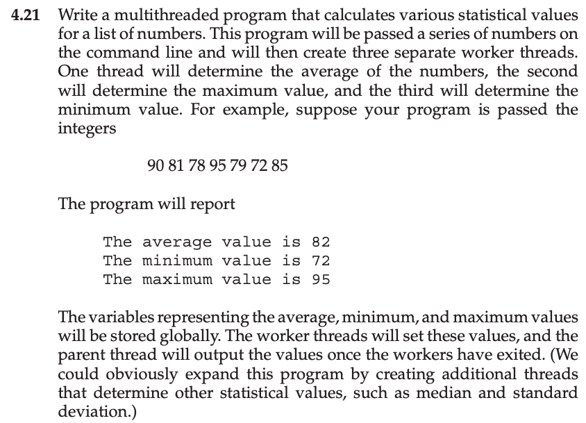
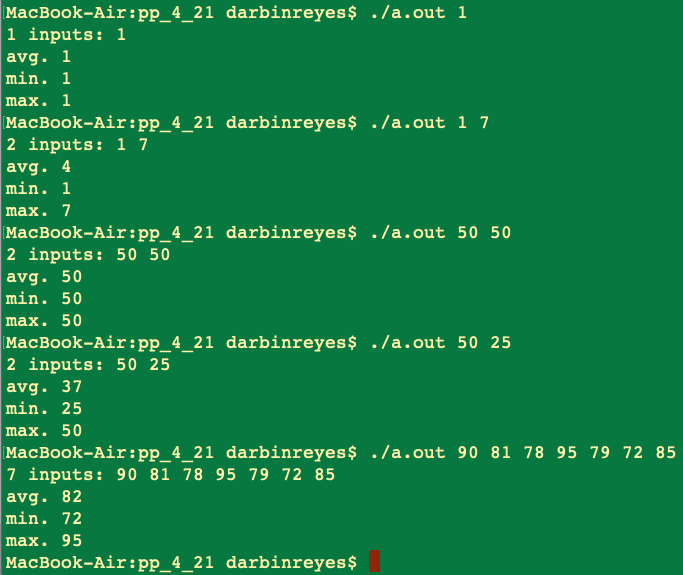

This is my solution to programming problem 4.21 from Operating System Concepts, Galvin.

Problem Statement.
===

Problem Notes.
===

Use 1 thread per statistic: average, min., max. .

Take input numbers from the command line.

Store results in global variable.

Parent thread prints results.

Solution Plan.
===

Implement a single threaded solution. Extend to use threads.

Solution Test Cases.
===

Solution Description and Results.
===

On Mac OS X,

To compile: `cc prog_prob_4_21.c`

To run: `./a.out`

End.
===