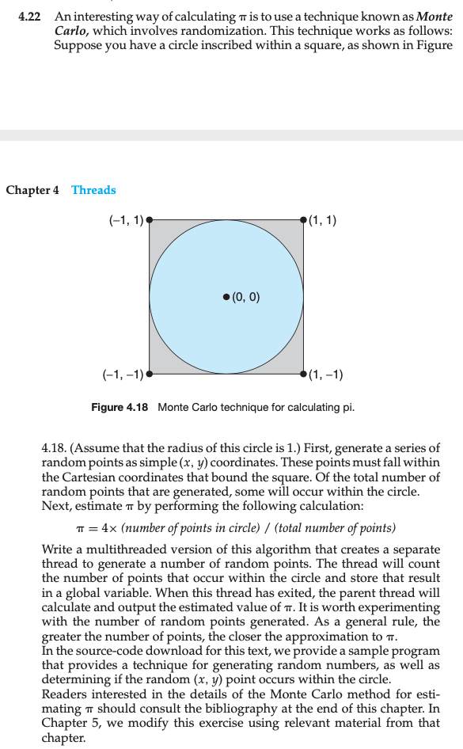
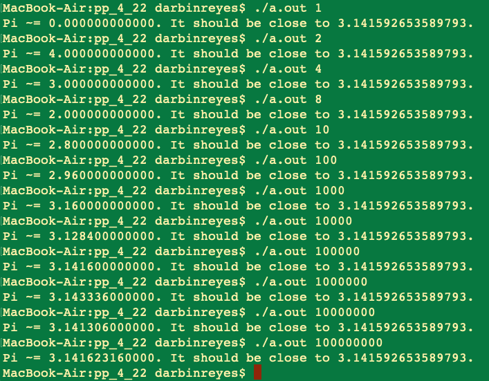
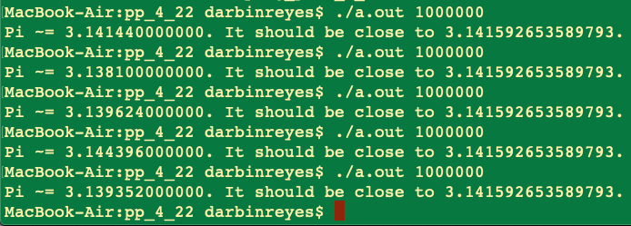
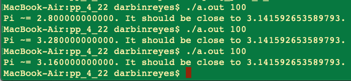
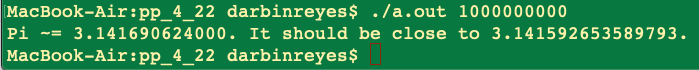
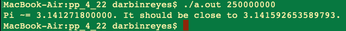

This is my solution to programming problem 4.22 from Operating System Concepts, Galvin.

Problem Statement.
===

Problem Notes.
===

The I could not find the “source code download” for this problem so I need to write it myself.

1 thread will generate the random points and count how many fall inside the unit circle.

The parent thread will output the estimate of pi.

Solution Plan.
===

Write a single threaded solution. Add the worker thread.

Solution Test Cases.
===

Several runs with 1 million points:

3 runs with 100 points, note the large variation in the pi estimate:

1 billion points:

1 billion points, divided between 4 threads:

Solution Description and Results.
===

I started my implementation using floats and the standard rand() function.
The estimate of pi is not very good, most of the time it is only accurate to 3 significant digits. Sometimes it is way off, even for the same number of points. Beyond 1 million points it begins to take seconds to complete. **1 billion points takes a long time - 10 minutes!. That was with the a single thread. With 4 threads, it took 25 minutes!**

To see if the estimates would be improved, I transitioned from floats to doubles. There was no noticeable improvement. After that I tried replacing rand() with arc4random_uniform(), since the man page for rand() indicated that it is rand() “obsolete". Again, there was no noticeable improvement in the estimate of pi.

On Mac OS X,

To compile: `cc prog_prob_4_22.c`

To run: `./a.out 1000000`

End.
===
