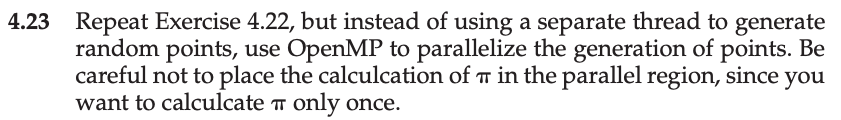
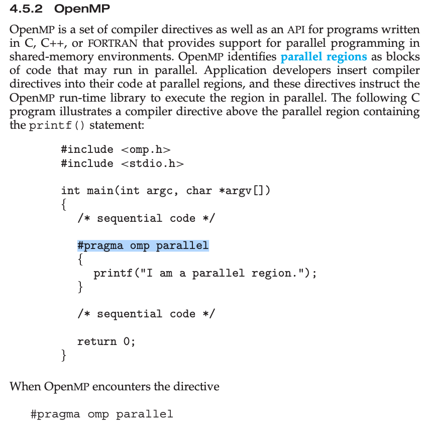
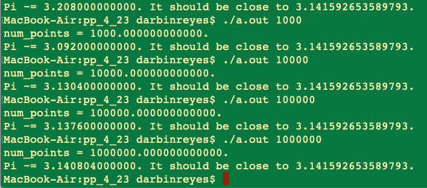

This is my solution to programming problem 4.23 from Operating System Concepts, Galvin.

Problem Statement.
===

Problem Notes.
===

Clip from textbook on using OpenMP:

Solution Plan.
===

Solution Test Cases.
===

Solution Description and Results.
===

omp.h is no longer available on macOS so I had to install it using mac ports.

OpenMP only creates a single thread, not sure why.

On Mac OS X,

To compile: `cc prog_prob_4_23.c`

To run: `./a.out 1000`

End.
===