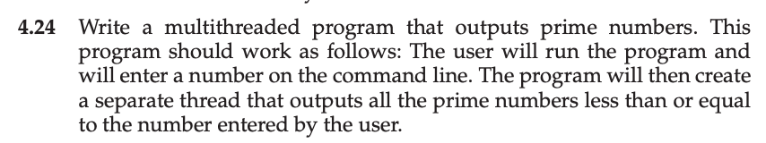
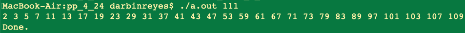

This is my solution to programming problem 4.24 from Operating System Concepts, Galvin.

Problem Statement.
===

Problem Notes.
===

Read user input - a single integer on the command line.

The integer is the upper bound on the number of primes to print.

Create thread:

For all primes <= upper_bound.

print prime.

Join thread.

Terminate.

Solution Plan.
===

Solution Test Cases.
===

Solution Description and Results.
===

On Mac OS X,

To compile: `cc prog_prob_4_24.c`

To run: `./a.out 111`

End.
===