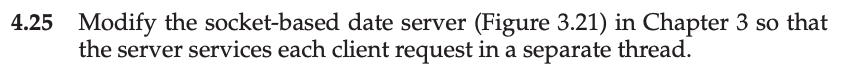
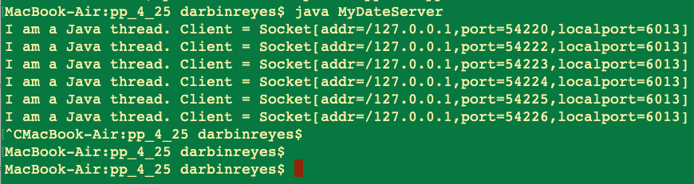
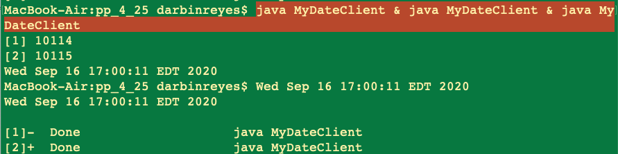

This is my solution to programming problem 4.25 from Operating System Concepts, Galvin.

Problem Statement.
===

Problem Notes.
===

I am only redoing problems in C. This is the solution I wrote in 2017.

Solution Plan.
===

Solution Test Cases.
===

Solution Description and Results.
===

On Mac OS X,

To compile:

* `javac MyDateServer.java`
* `javac MyDateClient.java`

To run:

* `java MyDateServer`
* `java MyDateClient`

* Running the server:

* Running the client:

End.
===

