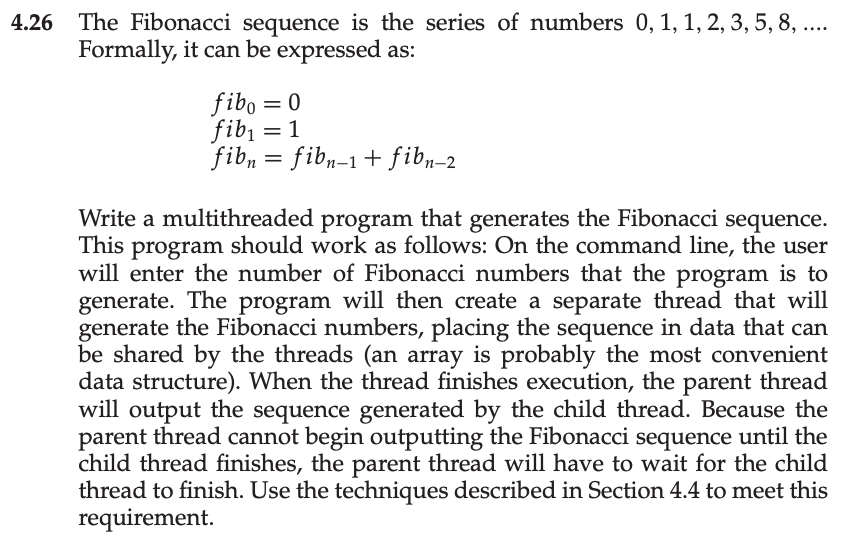
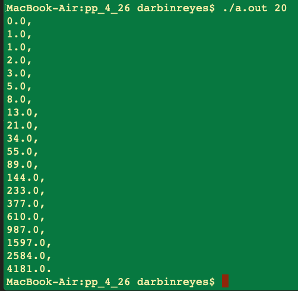

This is my solution to programming problem 4.26 from Operating System Concepts, Galvin.

Problem Statement.
===

Problem Notes.
===

Command line argument = number of Fibonacci numbers to print.

Child thread computes sequence, stores it in a external variable.

Parent outputs the sequence when child terminates.

Solution Plan.
===

Implement a single threaded solution, then add a thread.

Solution Test Cases.
===

`./a.out 7`

`./a.out 20`

`./a.out 0`, `./a.out -1`, `./a.out`

Solution Description and Results.
===

On Mac OS X,

To compile: `cc prog_prob_4_26.c`

To run: `./a.out 7`

End.
===