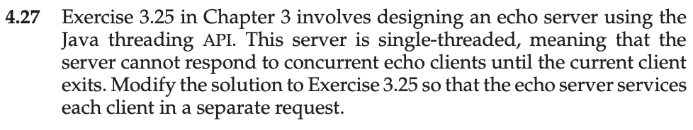

This is my solution to programming problem 4.27 from Operating System Concepts, Galvin.

Problem Statement.
===

Problem Notes.
===

**Will not solve. I am only solving the C based problems.**

Solution Plan.
===

Solution Test Cases.
===

Solution Description and Results.
===

On Mac OS X,

To compile:

To run:

End.
===