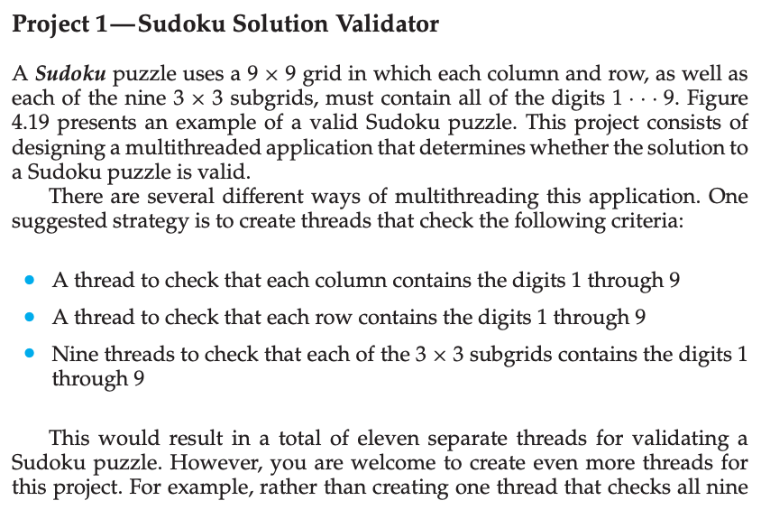
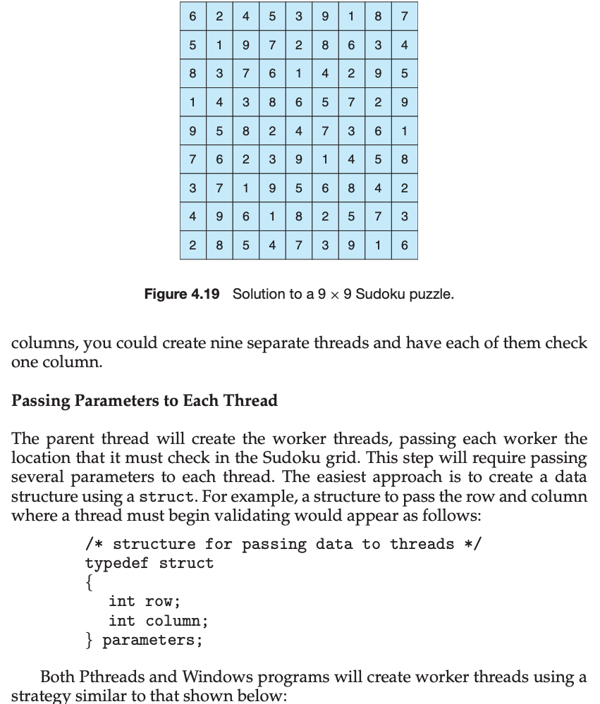
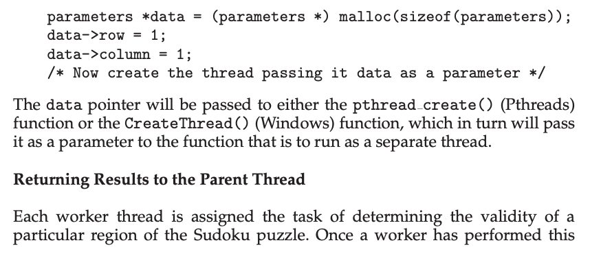
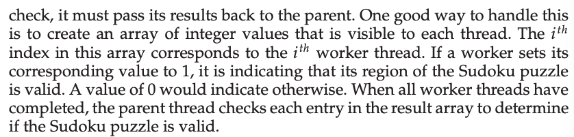
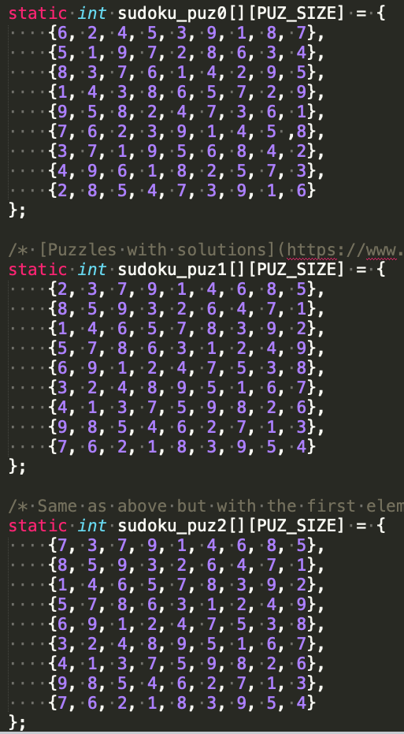
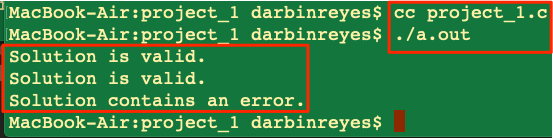

This is my solution to Chapter 4 programming project 1 from Operating System Concepts, Galvin.

Problem Statement.
===

Problem Notes.
===

1 thread to validate rows.

1 thread to validate columns.

9 threads to validate sub grids.

Pass starting location to threads using struct containing row/column.

Threads save result in a global variable before returning.

Solution Plan.
===

Enter example input into 2-D array.

Write a single threaded solution.

Write function to validate rows.

Write function to validate columns.

Write function to validate sub grids.

Convert to multithreaded.

Solution Test Cases.
===

Test given example.

Test on example from the web. [Puzzles with solutions.](https://www.puzzles.ca/sudoku/)

Test an incorrect solution.

Here are the 3 test cases, respectively.

Solution Description and Results.
===

On Mac OS X,

To compile: `cc project_1.c`

To run: `./a.out`

Here’s what the output looks like:

End.
===