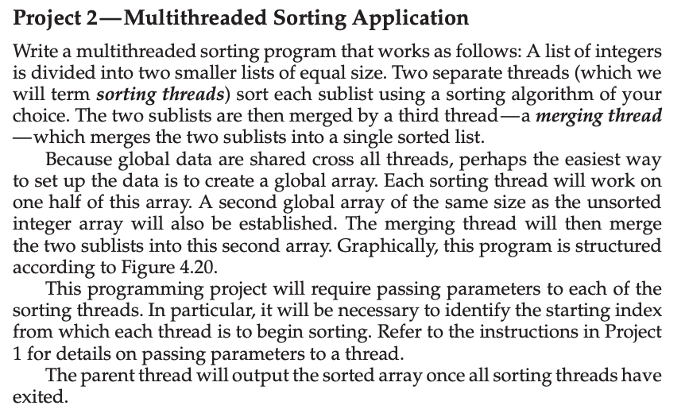
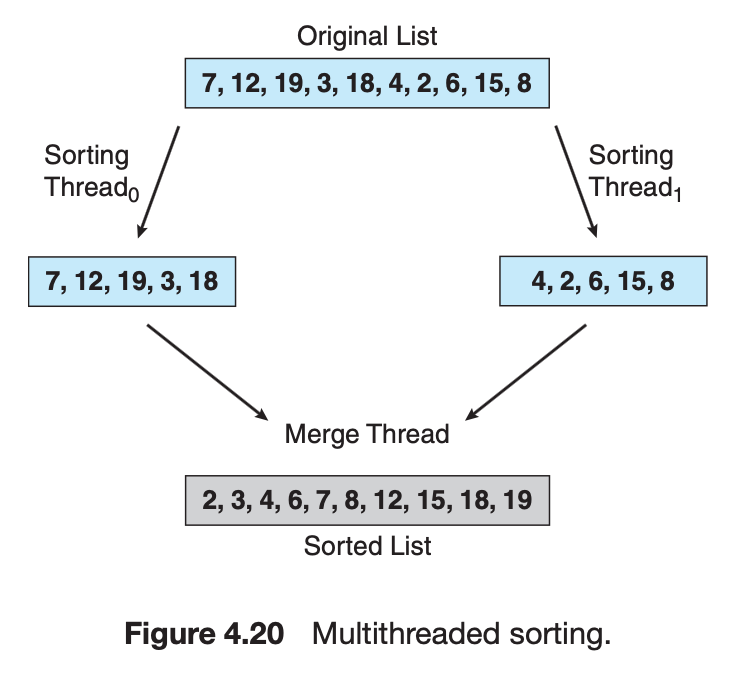
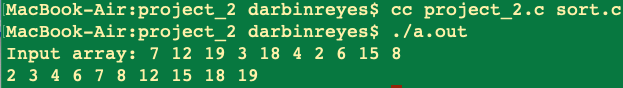
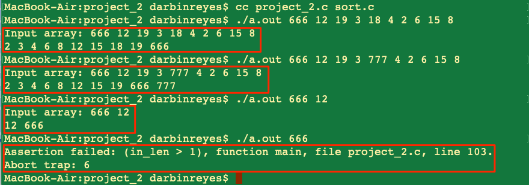

This is my solution to Chapter 4 programming project 2 from Operating System Concepts, Galvin.


Problem Statement.
===







Problem Notes.
===


1 global array to store the array to be sorted.


1 global array to store the final sorted array.


2 threads sort half of the array. 1 thread merges resulting sorted halves. Finally, the parent thread prints the sorted result.


Solution Plan.
===


### Scratch work.


* Dealing with even vs. odd numbered array lengths.


* {7,12,19,3,18,  4,2,6,15,8}
* Length = 10.
* First half [0, 10/2  - 1 = 5 - 1 = 4]. [0, 4]. [0, len/2 - 1].
* Second half [10/2 = 5, 10 - 1]. [5, 9]. [len/2, len - 1].
* {1,7,12,19,3,18,  4,2,6,15,8}
* Length 11.
* First half [0, 11/2 - 1]. [0, 5 - 1] = [0, 4].
* Second half [5, 10].

* The following bounds work for both even and odd numbered array lengths.
  * First half. **[0, len/2)**.
  * Second half. **[len/2, len)**.

* Corner cases.
* Length = 0. Nothing to sort.
* Length = 1. Just print the single number.

* Merging the sorted halves.


{7,12,19,3,18}
->
{3, 7, 12, 18, 19}

{4,2,6,15,8}
->
{2, 4, 6, 8, 15}

```
// scratch work
//================================
int i = 0, j = 0, k = 0;

// a0[], a0_len
// a1[], a1_len
// a_sorted[]

for (i = 0, j = 0; ;) {


}

while (k < (a0_len + a1_len) ) {

if (i < a0_len && j < a1_len) {
    if (a0[i] < a1[j]) {
        a_sorted[k] = a0[i];
        k++;
        i++;
    } else if (a0[i] == a1[j]) {
        a_sorted[k] = a0[i];
        k++;
        i++;
        a_sorted[k] = a1[j];
        k++;
        j++;
    } else { // a0[i] > a1[j]
        a_sorted[k] = a1[j];
        k++;
        j++;
    }
} else { // i >= a0_len || j >= a1_len

    if (i < a0_len) {
        a_sorted[k] = a0[i];
        k++;
        i++;
    } else if (j < a1_len) {
        a_sorted[k] = a1[j];
        k++;
        j++;
    } else {
        assert(0);
    }
}

}

```


```
// scratch work
//================================
// sorting function. lesser to greater. i.e. minimum element is placed at index 0.


// -1 = error.
// Returns index of the minimum element.
int get_min_index(int a[], unsigned int len) {
    unsigned int min, minidx;
    if (a == NULL || len <= 0) {
        assert(0);
        return -1;
    }

    minidx = 0;
    min = a[minidx];
    for (unsigned int i = 1; i < len; i++) {
        if (a[i] < min) {
            min = a[i];
            minidx = i;
        }
    }
    return mindx;
}

// 0 = success
int swap(int a[], unsigned int i, unsigned  int j, unsigned int len) {
    int t;
    if (a == NULL || i >= len || j >= len) {
        assert(0);
        return 1;
    }
    t = a[i];
    a[i] = a[j];
    a[j] = t;
    return 0;
}


void sort(int a[], unsigned int len) {
    int mi, r;

    // After the first loop iteration this maintains the lower half of the array sorted and the upper half unsorted. We maintain a pointer to the lowest unsorted element in the array and then the remainder of the array is searched for the minimum element, if that element is less than the former it is swapped with the latter.


    for(unsigned int i = 0; i < len - 1; i++) { // len-1 so we don’t search an array of length 1 in the last loop iteration. O(n^2).
         mi = get_min_index(&a[i+1], len - i - 1);
         assert(mi != -1);
         mi += i + 1;
         if (a[i] > a[mi]) {
             r = swap(a, i, mi, len);
            assert(r == 0);
        }
    }

}


```


Solution Test Cases.
===


Given from figure 4.20.


{7,12,19,3,18,  4,2,6,15,8}


Length = 10.


Solution Description and Results.
===


On Mac OS X,


To compile:  `cc project_2.c sort.c`


To run: `./a.out`


Here’s the output:








End.
===