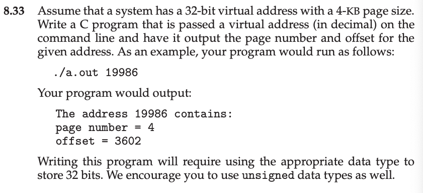

This is my solution to chapter 8 programming problem 8.33 from Operating System
Concepts,  Galvin.

Problem Statement.
===




Problem Notes.
===


This is a 6 line program, detailed notes are unnecessary.


Solution Plan.
===


Solution Test Cases.
===

`./a.out 19986`
```
The address 19986 contains:
page number = 4
offset = 3602
```


Solution Description and Results.
===


On Mac OS X,
To compile: `cc programming_problem_8_33.c`
To run: `./a.out 19986`


End.
===