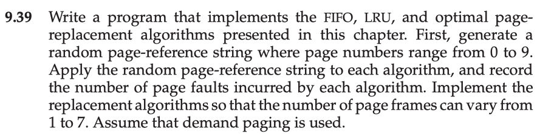
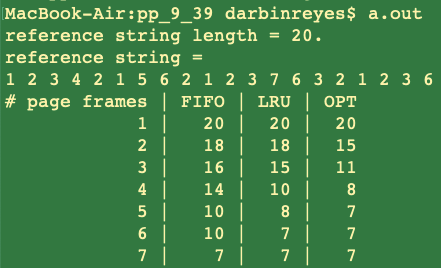
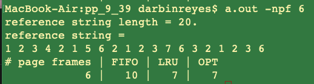
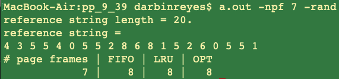
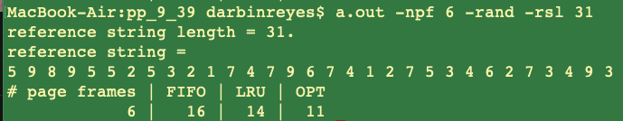
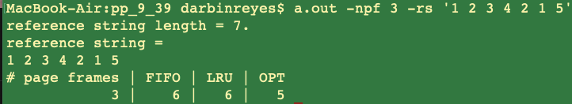

This is my solution to programming problem 9.39 from Operating System Concepts, Galvin.

Problem Statement.
===




Problem Notes.
===


// SCRATCH WORK START

- OSC ch.9 pseudo code. - in C because that would be the real implementation.
- FIFO replacement -> Queue ADT. -> Array based implementation in C.
- LRU replacement -> Stack ADT with middle entry removal->Linked list
- Design OPT replacement implementation.


```
//*****************************
/*
Array based queue implementation
*/
// headi: if not empty, points to front entry.
// taili: if not full, points to the next free spot at the back of the queue.
// empty: if headi == taili.
// full: (taili+1)%a.len == headi.
// must keep 1 array element empty so we can distinguish between FIFO empty and FIFO full.
if(headi <= taili)
num_entries = taili - headi;
else // headi > taili
num_entries = (taili+a.len) - headi;

// Roughly - not perfect - check full/empty.
enque(e){
if(not full)
a[taili] = e;
taili=(taili+1)%a.len;
}

e dequeue(){
if(not empty)
e = a[headi];
a[headi] = null;
headi=(headi+1)%a.len;
}
//*****************************

int num_page_frames;
queue_t q;
int *ref_str;
int npfaults;

void init(int N, int ref_str_len) {
    num_page_frames = N;
    q = init_queue(N);
    ref_str = random(0, 9, ref_str_len);
    npfaults = 0;
}

void reference_page(int p) {

    if(num_page_frames > 0) {
        num_page_frames--;
        q->enq(p);
    } else {
        if (!q->contains(p)) {
            // page replacement required.
            pf = q->deq();
            pf->pn = p;
            q->enq(pf);
            npfaults++;
        } else {
            // Page was in memory
        }
    }

}

//*****************************
/*
Stack. keep a stack of page numbers. A page reference causes that page to be removed from the stack and placed at the top of the stack. Therefore, the most recently used page is at the top of the stack and the least recently used page is at the bottom of the stack, as in figure 9.16. Since entries are removed from the middle of the stack, we implement the stack using a doubly linked list with a head and tail pointer. In the worst case, placing a page at the top of the stack requires updating 6 pointers. In exchange, we no longer need to search the page table, the page to be replaced is always at the bottom of the stack.
*/
```

```
// Usage: prog_prob_9_39 -l ref_string_len -n num_page_frames
// Usage: prog_prob_9_39 -n num_page_frames -s 2 3 5 3 6

int main(int argc, char **argv) {
int ref_string_len;
int num_page_frames;
int *ref_string;
int i;

// Set ref_string_len and num_page_frames to values obtained from command line.
ref_string =
for(i = 0; i <


}
```

Might be convenient to implement in python. Data structures are built-in.

// SCRATCH WORK END

Solution Plan.
===

The solution will be implemented in C.

A linked list based stack will be used to implement the LRU replacement algorithm.

An array based queue will be used to implement the FIFO replacement algorithm.

A primitive integer array will be used to implement the OPT replacement algorithm.

Solution Test Cases.
===

The reference string from exercise 9.8 will be used for testing since the solution to the exercise provides the correct page fault counts for all three replacement algorithms and 1 through 7 page frames. If the output of my program matches the solution, I can be confident that my program is correct.

Solution Description and Results.
===

The main function is contained in the file pp_9_39.c . The files arr.c list.c queue.c implement the data structures used to implement the page replacement algorithms. The file page_repl.c contains the implementations of the page replacement algorithms.

The program accepts a few command line arguments, but argument parsing is not implemented in a robust way, since this isn't explicitly required by the programming problem. The number of page frames used is controlled by the -npf argument. The length of the reference string is controlled by the -rsl argument. The supported command argument combinations are described below, using argument combinations other than the documented ones may not work. Even with the documented usage examples, supplying invalid valid will likely break the program e.g. supplying non-integers where integers are expected.


Supported command line arguments:

```
$ a.out -x
Usage:
    a.out

    Default mode: Prints the number of page faults for a fixed reference string
    and 1 to 7 page frames.
    Reference string: 1 2 3 4 2 1 5 6 2 1 2 3 7 6 3 2 1 2 3 6.
----------------
    a.out -npf 8
    Run against the fixed reference string using 8 page frames.
    Argument must be > 0.
----------------
    a.out -npf 9 -rand
    Use 9 page frames against a randomly generated reference string. The random
    reference string contains only page numbers in the range 0 to 9. The random
    reference string length is 20 by default. If -npf is not specified 7
    is the default.
----------------
    a.out -npf 10 -rand -rsl 31
    Use 10 page frames against a randomly generated reference string. The random
    reference string contains only page numbers in the range 0 to 9. The random
    reference string length is set to 31. If -npf is not specified 7
    is the default.
----------------
    a.out -npf 11 -rs '1 2 3 4 5 1 2 3 6'
    Use 11 page frames against the reference string specified by the -rs
    argument. The single quotes are required.
Unsupported command line arg. combination. Bye!
```


- On Mac OS X,
    - To compile: $ cc pp_9_39.c args.c list.c page_repl.c queue.c arr.c
    - To run:
a.out




a.out -npf 6




a.out -npf 7 -rand




a.out -npf 6 -rand -rsl 31




a.out -npf 3 -rs '1 2 3 4 2 1 5'




End.
===