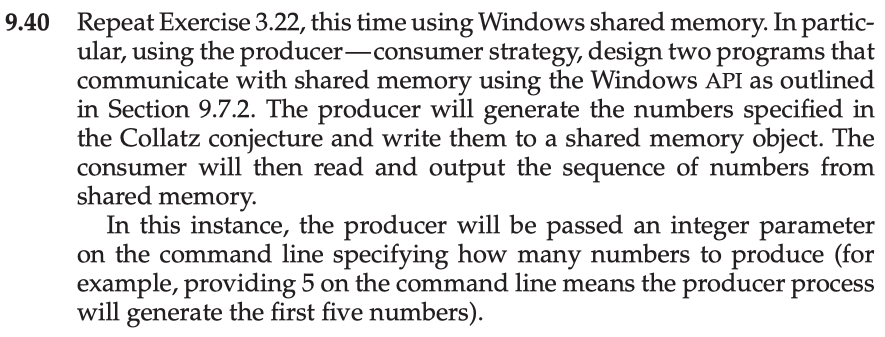

This is my solution to programming problem 9.40 from Operating System Concepts, Galvin.

# Problem Statement.

# Problem Notes.

"providing 5 on the command line means the producer process will generate the first five numbers" - is this a typo? Ex.3.22 specifies that the command line argument is the starting number for the Collats sequence. Furthermore, it may be the case that more than one starting number for the Collatz sequence produces 5 numbers; in which case the input does not specify a unique output! Case in point: starting the sequence with 12, produces 10 numbers, starting the sequence with 13 also produces 10 numbers, what then, does it mean for "the producer process \[to] generate the first ten numbers"? I will assume it is a typo.

Also see important notes in given README (not this README.md).

# Solution Plan.

Reuse code from my solution to ex.3.22.
Follow notes in given README (not this README.md).
Convert given windows code into its UNIX equivalent.

# Solution Test Cases.

Tests:

Get error on: -1, 0.

Check that we get a reasonable output for integers between 1 and 14.

Check that 35 generates the following sequence (given in ex.3.21):

35, 106, 53, 160, 80, 40, 20, 10, 5, 16, 8, 4, 2, 1.

# Solution Description and Results.

* On Mac OS X,
* To compile: `make`
* To run: 
    * Run `producer.bin 8
    * In another terminal, run `consumer.bin`

# End.
