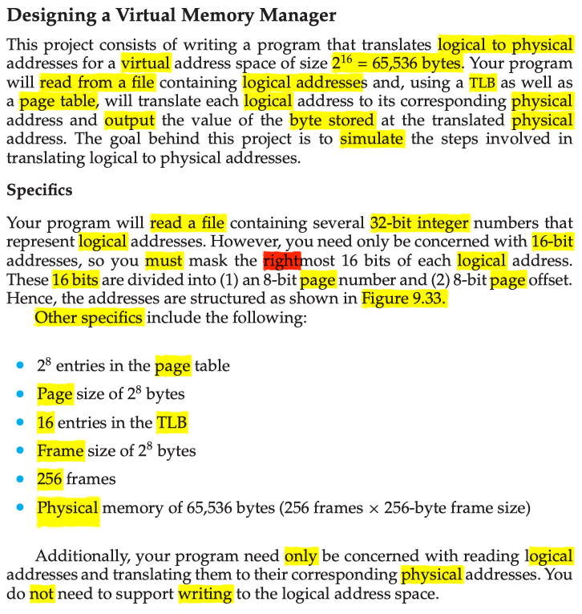
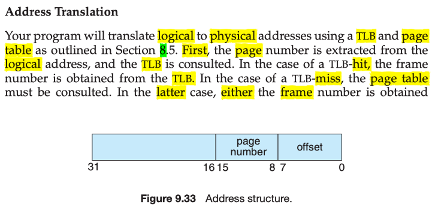
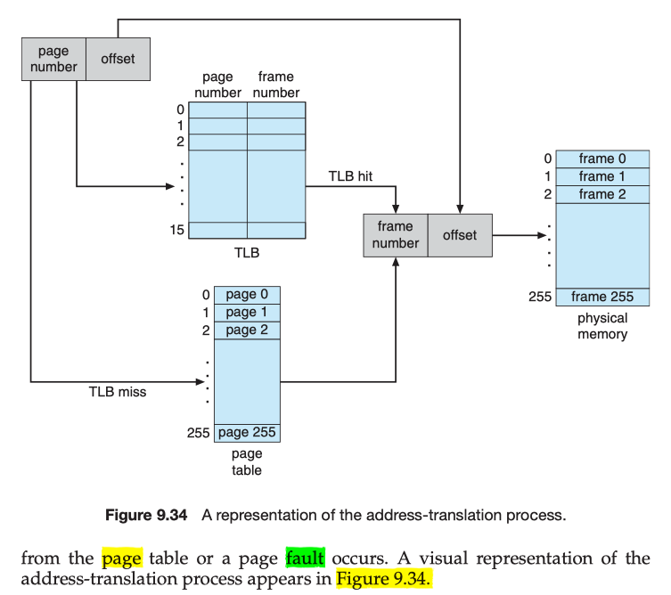
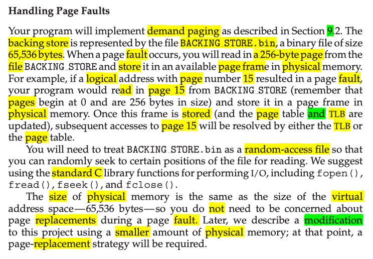
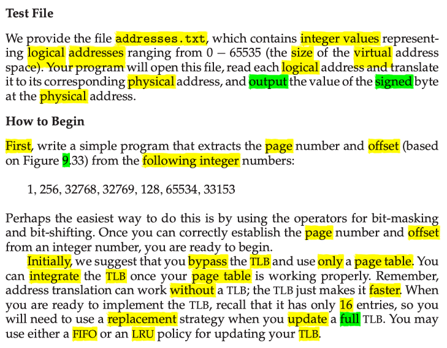
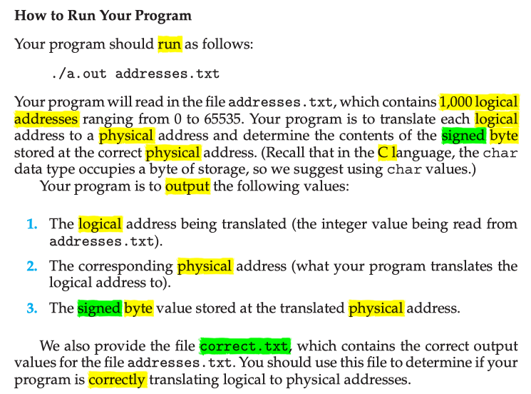
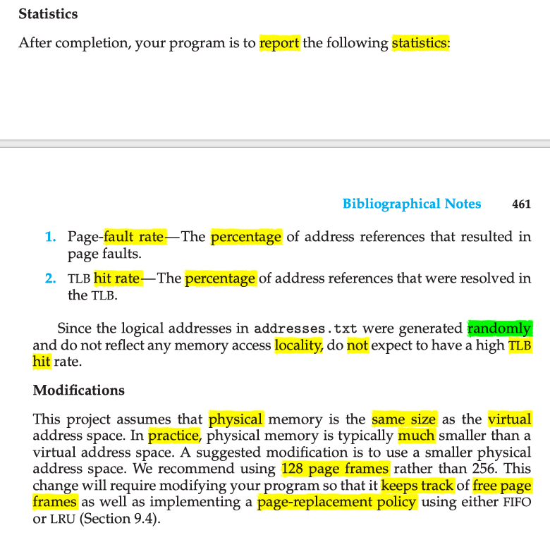

# Programming Project 9.1

This is my solution to chapter 9 programming project 1 from Operating System
Concepts, Galvin.

# Problem Statement

# Problem Notes

See top of

`ch9/programming_projects/project_1_part_1/v2/project_1_part_1v2.c`

# Solution Plan

I started by implementing a solution as specified but without the TLB. Then a
TLB was added. Finally, I reduced the number of page frames as described under
modifications. The solution was developed in over 3 separate versions, starting
with the code in `v0/` , when v0 was completed, it was copied into `v1/` and then
modified. The final solution is contained in `v2/` , which contains a make file
for building and running. The make file creates 3 .bin files as follows:

- sim_vm_mngrv0.bin: No TLB, 256 frames, 256 pages. Run with `make run0` .
- sim_vm_mngrv1.bin: With TLB, 256 frames, 256 pages. Run with `make run1` .
- sim_vm_mngrv2.bin: With TLB, 128 frames, 256 pages. Run with `make run` .

The source file containing `main()` is:

`ch9/programming_projects/project_1_part_1/v2/project_1_part_1v2.c`

The shell script `v1/awk_strip.sh` can be applied to the given `correct.txt` to
produce output suitable for comparison with the output of `sim_vm_mngrv2.bin` .
This is necessary because the physical addresses are different when only 128
frames are used.

# Solution Test Cases

It is given that we use the file `correct.txt` for testing. I verified my
solution's output using the UNIX `cmp` command.

# Solution Description and Results

* On Mac OS X,
* To compile:
    * `make`
* To run:
    * `make run`

### Observed Statistics

* No TLB, 256 frames, 256 pages:
  * N REFS 1000
  * N PAGE FAULTS 244 (%24.400000)

* With TLB, 256 frames, 256 pages:
  * N REFS 1000
  * N PAGE FAULTS 244 (%24.400000)
  * N TLB HITS 55 (%5.500000)

* With TLB, 128 frames, 256 pages:
  * N REFS 1000
  * N PAGE FAULTS 538 (%53.800000)
  * N TLB HITS 53 (%5.300000)

# End